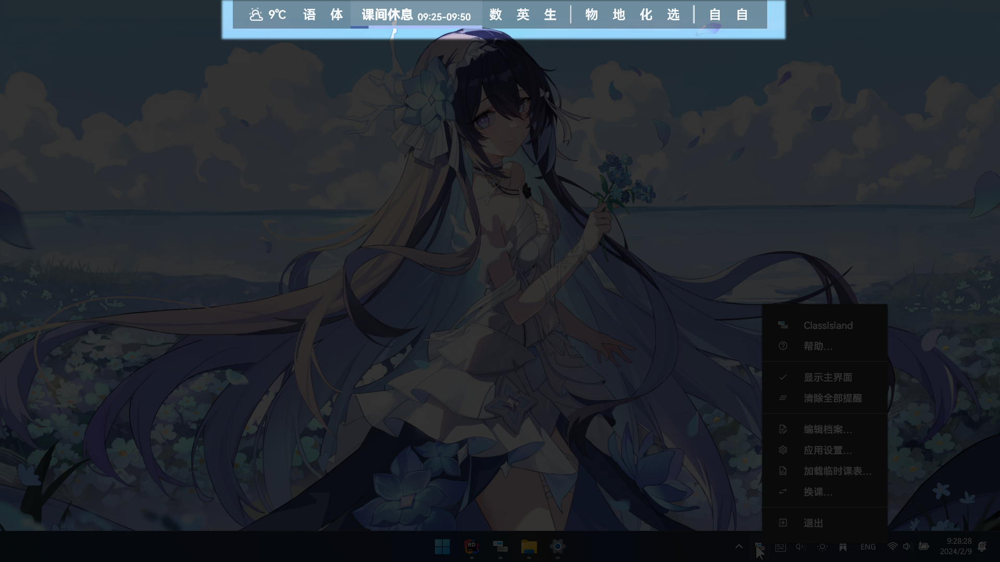
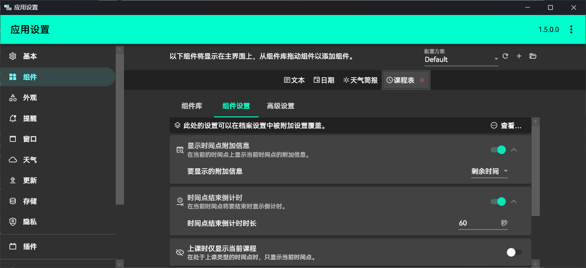

# 基本

本文档主要讲述应用的基本操作。

## 主菜单

应用在启动时，会在系统托盘创建一个托盘图标。在启动软件后，本应用会在任务栏托盘中显示软件的图标。如果您没有看到这个图标，请点击托盘左侧的展开按钮展开托盘菜单，并考虑将本软件的图标固定到任务栏上。

点击这个图标，可以打开软件的主菜单。本软件的各个功能都需要从这里访问。您可以右键托盘图标打开主菜单，访问应用的各个功能。

## 主界面

应用会在桌面上创建一个具有半透明背景的窗口，默认停靠在屏幕中上方。该窗口会显示启用的课表，并标注当前的时间点。

当鼠标移到主界面上方时，主界面会自动降低不透明度，确保不遮挡窗口后方内容。鼠标点击可以穿透窗口，操作窗口后方的内容。

> [!warning]
> 默认情况下，ClassIsland 使用 RawInput 来接收输入事件。这种方法可以允许 ClassIsland 分别对鼠标和触摸输入做出更适合的响应，但兼容性不佳。如果此功能在您的设备上无法正常工作，可以在在[【应用设置】→【窗口】](classisland://app/settings/window)】中关闭【使用原始输入】选项。

本软件的主界面默认会显示在屏幕的上方，课表、提醒等信息都会显示在此处。当处于某个课程时，对应课程会展开显示，并在下方显示进度条。

在[【应用设置】→【窗口】](classisland://app/settings/window)中，您可以调整主界面的停靠位置和窗口层级，以及指针移入隐藏的相关选项。

在[【应用设置】→【外观】](classisland://app/settings/appearance)中，您可以调整主界面的缩放大小和背景不透明度。

## 组件

::: note
如果您想了解如何开发组件，请参考[开发文档](../dev/components.md)。
:::

您可以通过[【组件】](classisland://app/settings/components)功能自定义要在主界面上显示的信息。

主界面默认显示【日期】和【课程表】组件，您可以根据需要自行添加和删除组件。

将要添加的组件从组件库中拖动到组件栏中即可添加组件，拖动组件栏上的组件可以调整组件显示顺序。选择组件栏上的组件后，如果组件具有设置选项，会自动显示组件设置。组件间设置相互独立。

::: tabs

@tab 添加组件

@tab 调整组件顺序

:::

点击组件旁的【删除】按钮即可删除选中的组件。

您可以在右上角创建、切换、导出和导入不同的组件配置方案。

## 课程表组件

应用默认在主界面上显示的课表事实上也是一个组件，您可以在对应的[组件设置](classisland://app/settings/components)中调整相关的设置。课程表显示相关设置也可以在[附加设置](./advanced.md#附加设置)中指定。

## 附加信息

应用的课表组件默认会在当前的时间点旁显示附加信息（如图）。

您可以在对应的[组件设置](classisland://app/settings/components)中开关附加信息的显示，以及调整显示的信息内容。

## 时间点结束倒计时

::: warning 

这和即将上课倒计时不是一个东西。要调整即将上课倒计时，请在[【提醒】](classisland://app/settings/notification/08F0D9C3-C770-4093-A3D0-02F3D90C24BC)选项卡中调整相关设置。
:::

应用默认会在时间点结束前 60 秒在显示附加信息的位置显示时间点结束读秒。

您可以在对应的[组件设置](classisland://app/settings/components)中调整此功能。

## 插件

::: note
如需了解插件开发详细信息，请参考[插件开发文档](../dev/plugins/README.md)。
:::

<!--  这里没有照片！ -->

ClassIsland 从 1.5 版本开始引入了插件系统:允许用户通过安装插件来扩展软件功能。插件可以提供额外的组件、增强现有功能或集成第三方服务。

## 插件功能示例

插件系统为 ClassIsland 带来了丰富的功能扩展可能，常见的插件用途包括：

- **数据统计与分析**：记录学习时间分布、课程出勤统计、学习效率分析等
- **外部服务集成**：与日历应用同步课表、连接待办事项应用、推送课程提醒到其他设备
- **界面增强**：添加自定义主题、调整布局样式、增加动画效果
- **教学辅助**：课堂签到功能、随堂测验、学习资料管理
- **系统集成**：课程开始前自动调节系统音量、切换勿扰模式、执行自定义脚本

## 插件安装与管理

您可以通过[【应用设置】→【插件】](classisland://app/settings/plugins)页面管理所有插件：

1. **安装插件**
   - 点击"添加插件"按钮，选择本地插件文件进行安装
   - 从官方插件库在线安装推荐的插件
   - 支持导入第三方开发的插件包

2. **插件状态管理**
   - 启用/禁用：通过插件旁的开关控制功能状态
   - 配置设置：部分插件提供独立的设置界面
   - 更新检查：系统会自动检测可用更新并提示

3. **插件维护**
   - 卸载不再需要的插件
   - 备份插件配置方案
   - 查看插件运行状态和日志

## 插件与组件的区别

理解插件与组件的差异有助于更好地使用 ClassIsland：

| 特性 | 组件 | 插件 |
|------|------|------|
| **功能范围** | 主要在主界面显示信息 | 可扩展软件任何功能 |
| **交互能力** | 有限的界面交互 | 完整的界面和后台操作 |
| **集成深度** | 表层显示 | 深度集成，可修改核心行为 |
| **开发复杂度** | 相对简单 | 较为复杂 |
| **典型用途** | 日期显示、课表展示 | 数据统计、外部服务集成 |

::: tip
大多数用户会从使用组件开始，当有更复杂的需求时再考虑安装相应的插件。您可以在[社区论坛](https://github.com/ClassIsland/ClassIsland/discussions)中发现其他用户分享的实用插件。
:::
