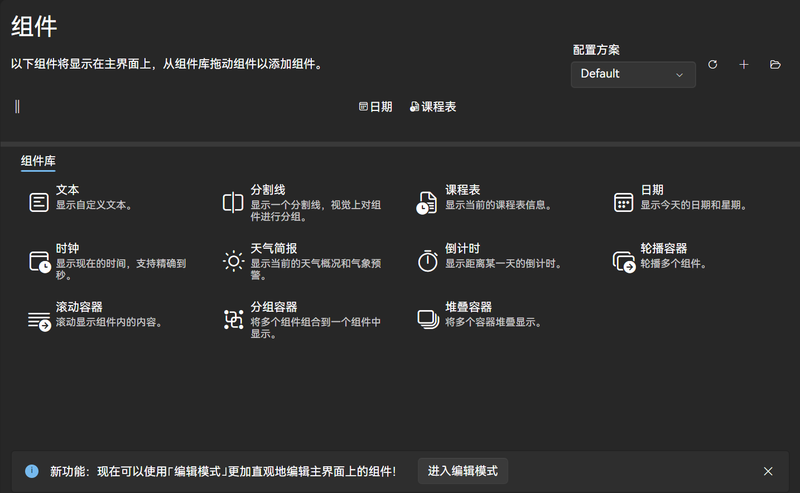
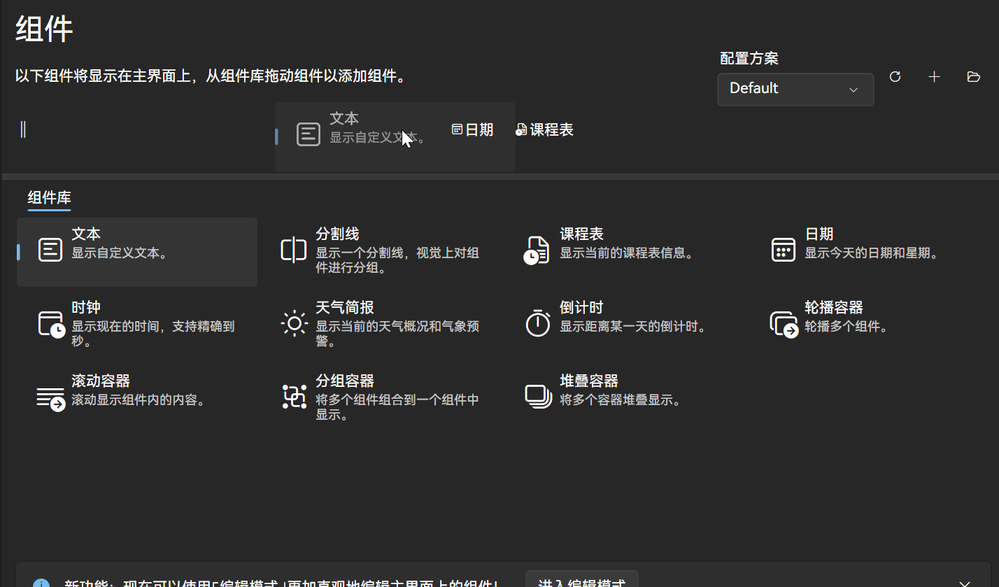
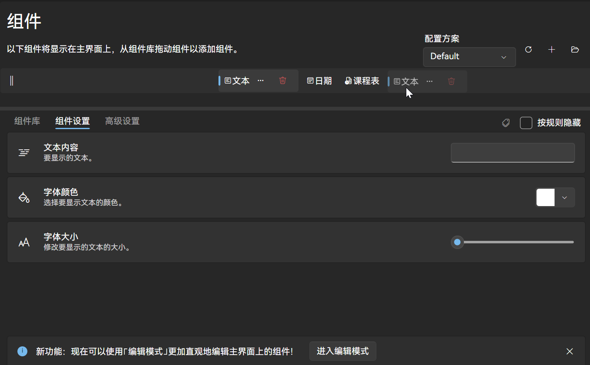
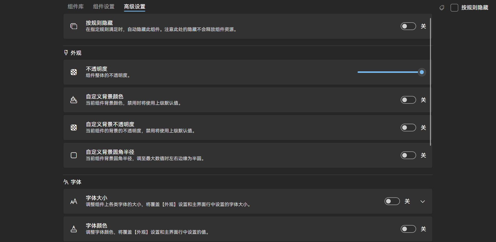
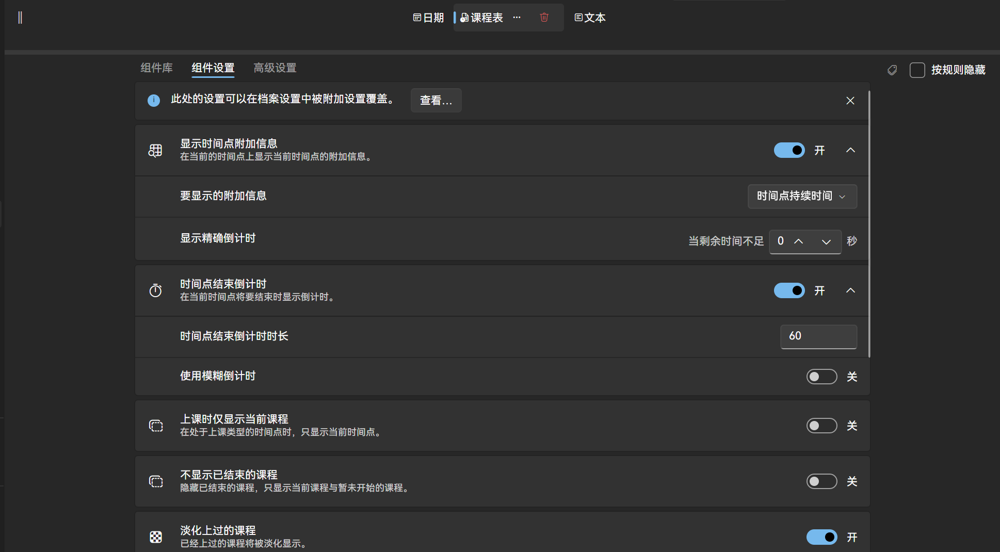
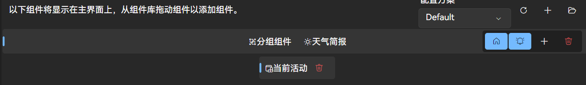

# 组件

::: note
如果您想了解如何开发组件，请参考[开发文档](../dev/components.md)。
:::

您可以通过[【组件】](classisland://app/settings/components)设置页面自定义要在主界面上显示的信息。

主界面默认显示【日期】和【课程表】组件，您可以根据需要自行添加和删除组件。

将要添加的组件从组件库中拖动到组件栏中即可添加组件，拖动组件栏上的组件可以调整组件显示顺序。选择组件栏上的组件后，如果组件具有设置选项，会自动显示组件设置。组件间设置相互独立。

:::: tabs

@tab 添加组件

使用鼠标或触屏将组件从组件库拖动到组件栏中即可添加组件。

@tab 调整组件顺序

将组件栏中的组件拖动到其他位置后松开即可调整组件顺序。

::::

点击组件旁的【删除】按钮即可删除选中的组件。

## 组件高级设置

- **按规则隐藏:** 启用该设置后，您可以点击“编辑规则集”按钮，设置[规则集](automation.md#规则集)。当规则集被满足时，该组件将会被隐藏，不再在主界面显示或占用位置。
- **字体:** 启用“字体大小”或“字体颜色”设置后，您可以设置该组件的字体大小。该设置优先级高于您在“外观”界面设置的同类设置。
- **对齐方式:** 该设置仅在容器组件处且容器组件有宽度设置时实际生效，默认为“拉伸”。为容器组件设置后，其所有的子组件将在该容器组件内按照设置居左/中/右对齐。
- **固定宽度/宽度限制:** 启用并设置固定宽度后，不论组件内容实际长度，该组件都占用（显示）你设定的宽度，且超出宽度的内容会被从右截断。宽度限制类似。

## 组件字体大小

ClassIsland 共有四类字体大小设置，字体自小到大（默认情况下）分别为`次级字体大小`、`正文字体大小`、`强调字体大小`和`大号字体大小`。

下面分别介绍这四类字体大小设置的应用。

##### 次级字体大小
- 【天气简报】气象预警名称的文字

#### 正文字体大小
- 【日期】（全部）
- 【天气简报】天气信息（气温/湿度/…）
- 【课程表】“明天”标签
- 【倒计时日】连接词（“距离”“还有”等，“天”除外）

#### 强调字体大小
- 【时钟】（全部）
- 【课程表】科目名等

## 课程表组件

应用默认在主界面上显示的课表事实上也是一个组件，您可以在对应的[“组件设置”](classisland://app/settings/components)中调整相关的设置。课程表显示相关设置也可以在[附加设置](./advanced.md#附加设置)中指定。

## 多行组件

单击组件两侧的空白位置后，设置界面将显示多行组件操作按钮。

- 点击 **<i class="fa-solid fa-house"></i> 按钮** ，可设置**此行**为 **`主要行`**。提醒将优先在 **`主要行`** 发出，但是改行没有启用提醒除外。
- 点击 **<i class="fa-solid fa-bell"></i> 按钮** ，可设置是否允许在**此行**发出提醒。
- 点击 **“+”号** ，可添加新的一行（只能添加到**此行的下一行**）。

## 组件配置方案

您可以在右上角创建、切换、导出和导入不同的组件配置方案。同一时刻只能使用一种组件配置方案。

## 扩展组件

您可以通过安装[插件](classisland://app/settings/classisland.plugins)，获得更多可选择的组件类型和样式。

::: warning

插件及其提供的组件为第三方提供，ClassIsland开发团队不对使用插件及其提供的组件造成的问题负责。一些存在严重问题的插件可能造成程序部分或全部功能无法正常使用，甚至可能影响你的信息安全、电脑安全，请谨慎使用插件功能。

:::