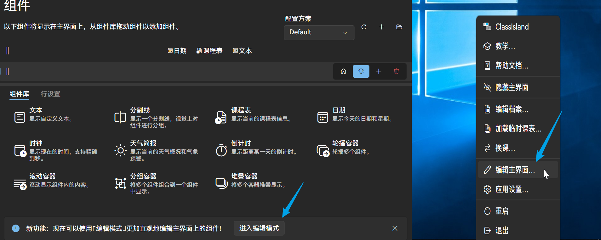
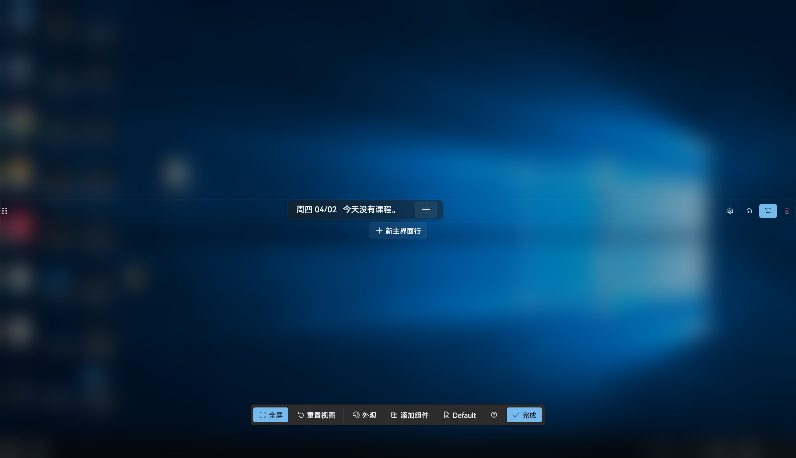
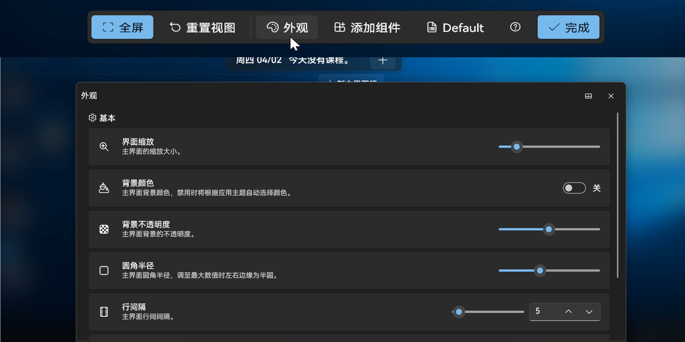
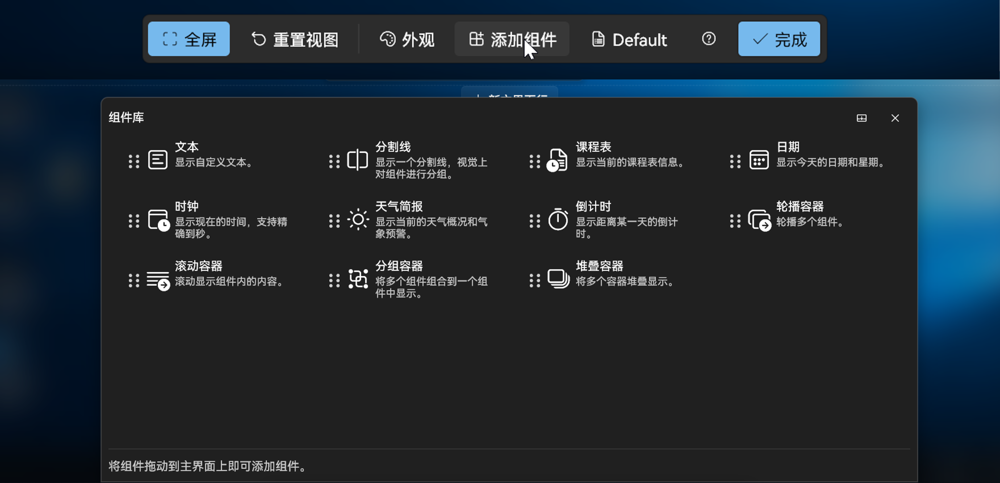
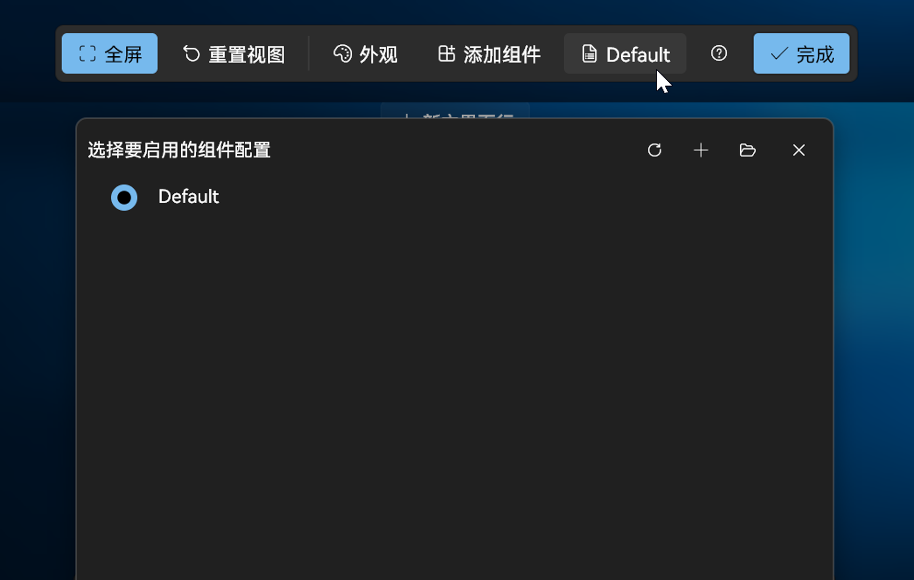
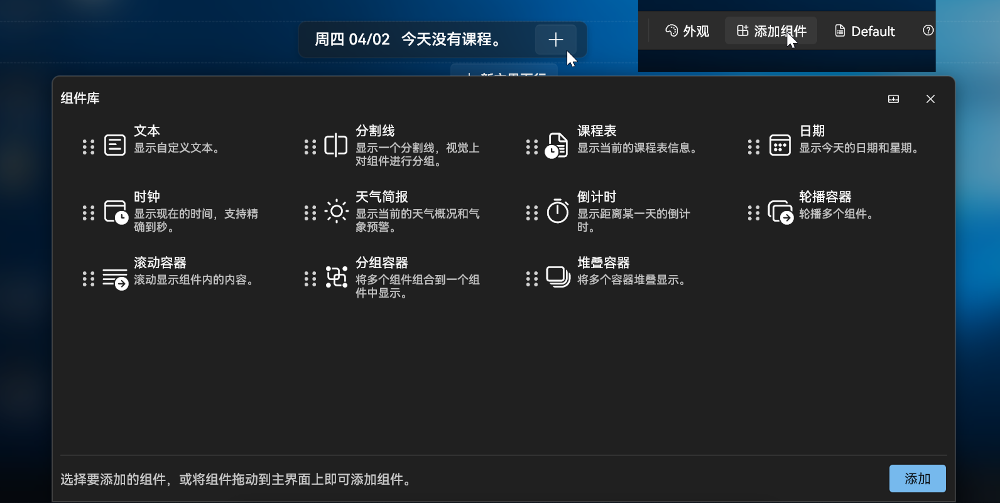
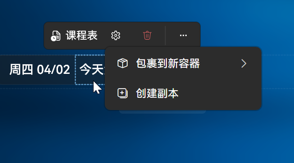
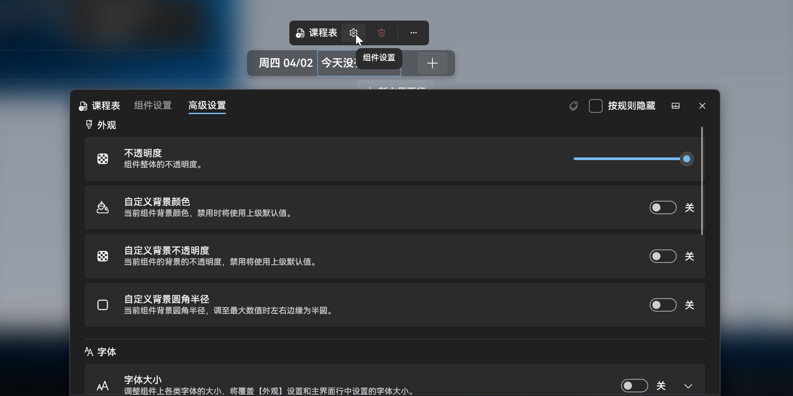
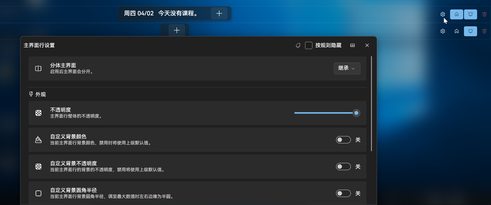

::: note
第一次进入该页面时会出现教程，如果您不想观看教程或已经熟悉操作，可以点击左下角的“跳过教程”按钮，您随时可以通过托盘菜单-教程...选项重新开始教程。
:::
# 编辑模式

在组件页面，点击下方的“进入编辑模式”按钮或点击托盘图标后点击“编辑主页面”即可进入编辑模式

## 底栏功能

编辑模式页面如下：

在下方的控制栏的左侧，您可以点击全屏按钮来进入/退出全屏模式。点击“重置视图”按钮可以使主页面组件编辑区域恢复居中。

“外观”按钮能够打开外观菜单，调整主页面的缩放、颜色、圆角等外观。

“添加组件”按钮能够打开组件库，您可以从组件库中将组件拖动到组件栏中来添加组件。

“添加组件”右侧的按钮能够打开组件配置页面，在该页面您可以快捷地切换当前启用的档案配置。

点击最右侧的“完成”按钮即可退出编辑模式。

## 主要编辑区域

主要编辑区的默认位置为屏幕正中央。

### 添加组件

您可以通过底栏的“添加组件”按钮打开组件库，从组件库中将组件拖动到组件栏中或点击主页面右侧的加号打开组件库，点选想要添加的组件，点击确定来添加组件。

### 调整组件设置

点击主页面中的组件后，组件上方将出现一个工具栏，工具栏中将显示组件名称，并列出组件设置、删除组件、更多设置三个按钮，更多设置中包含包裹到新容器（包含轮播容器、滚动容器、分组容器与堆叠容器）与创建副本两个选项。

点击组件设置后，将弹出组件的设置界面，您可以在该界面调整组件的设置。（包含组件基本设置与高级设置）

### 新增主界面行

点击当前已有主界面行下方的“新主界面行”按钮即可在该行下方新增一行主界面行。

### 主界面行设置

在每个主界面行右侧包含主界面行设置项，包含设置、设为主要行、允许显示通知与删除四个选项。

点击设置按钮后，将弹出主界面行设置界面，您可以在该界面调整主界面行的设置。

主界面设置区域可以通过触摸手势缩放与移动。