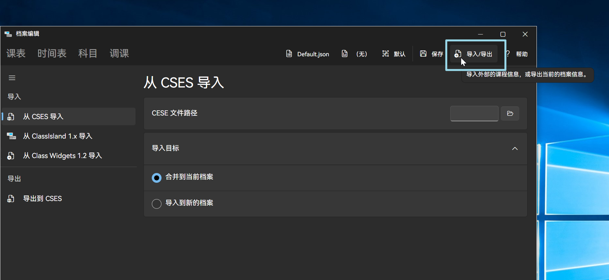
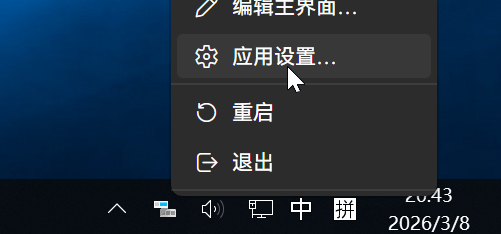
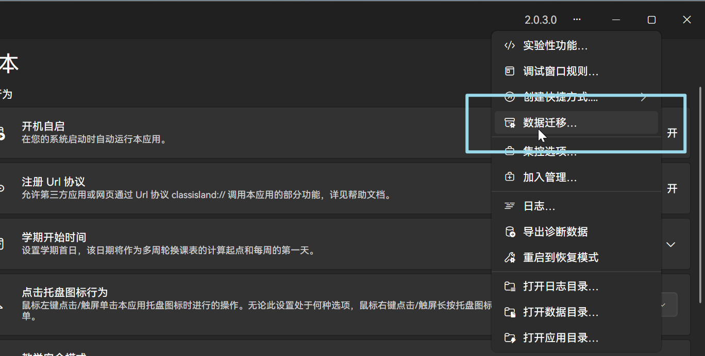
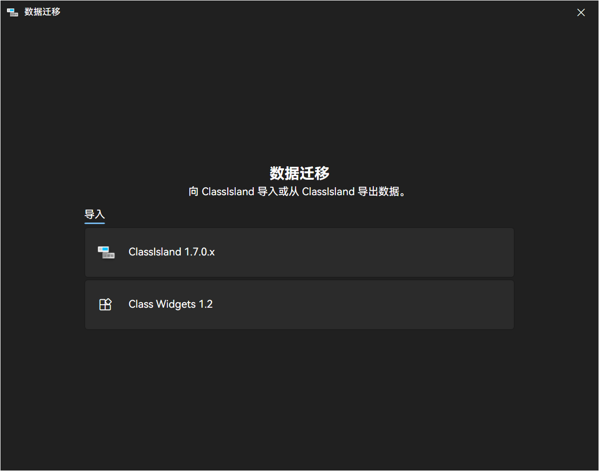
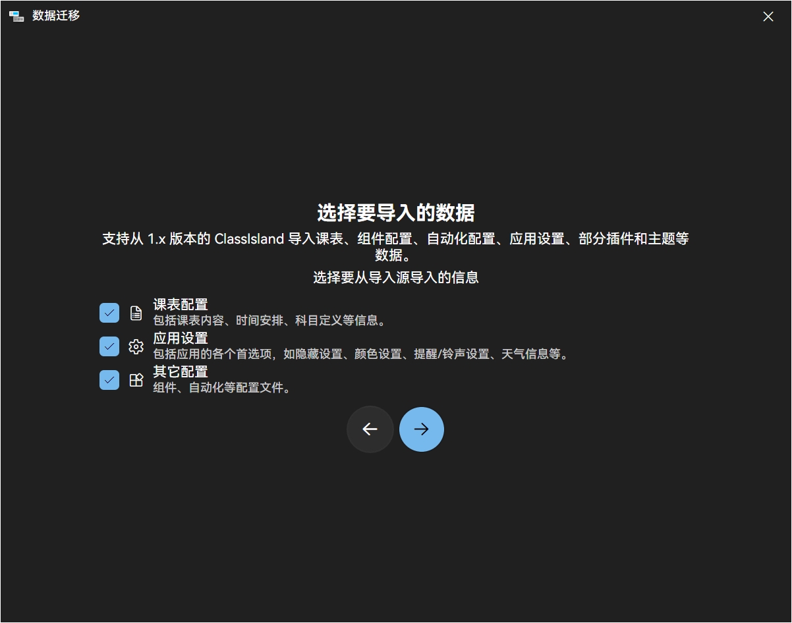

# 迁移课表

ClassIsland 软件内提供有导入入口，可以从CSES（仅课表）、Classisland 1.x、Class Widgets 1.2快捷导入课程表数据。

CSES:全名The Course Schedule Exchange Schema，一种通用的课程表交换格式，用于在不同软件之间交换课程表。

<!--转换工具已经部署在 [https://migrate.classisland.tech/](https://migrate.classisland.tech/) 上，可以直接访问使用。-->
## CSES导入方法

通过托盘菜单打开“档案编辑”页面，点击页面右上角的“导入/导出”按钮。

在该页面左侧边栏选中从 CSES 导入，选择 CSES 文件后，选择合适的导入模式，点击“导入”按钮即可完成导入。

## ClassIsland 1.x 、Class Widgets 1.2 导入方法

ClassIsland 1.x 和 Class Widgets 1.2 目前已经支持课表配置与应用设置的导入功能。

右键软件托盘，打开“应用设置“页面，如图。

在应用设置页面的右上角菜单中，点选“数据迁移”选项，如图。

点击后，将出现数据迁移向导页面，如下图。

在该页面，选择迁移的来源，随后选择要迁移的数据（教程以 ClassIsland 1.x 为例），在下一页中选中ClassIsland 1.x 的可执行程序（从Class Widgets 1.2 迁移时则选中 Class Widgets 1.2 可执行程序所在的文件夹），点击“下一步”按钮即可完成迁移。

