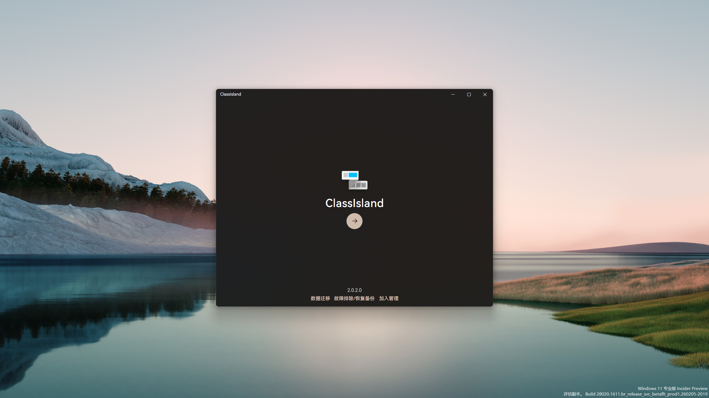
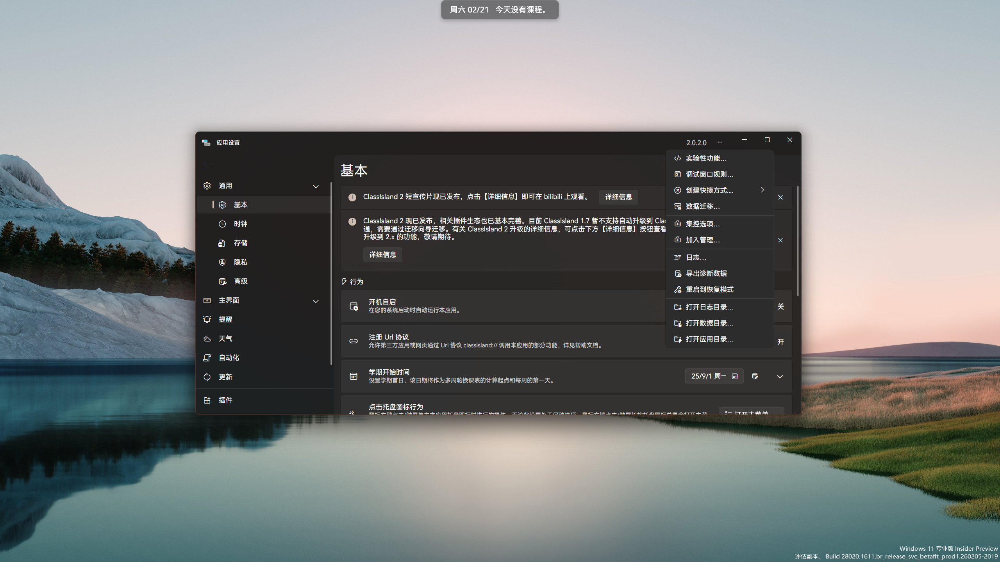
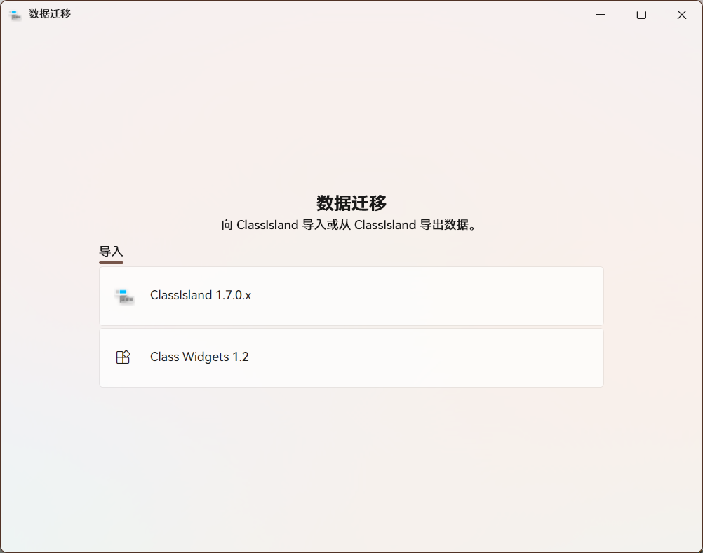
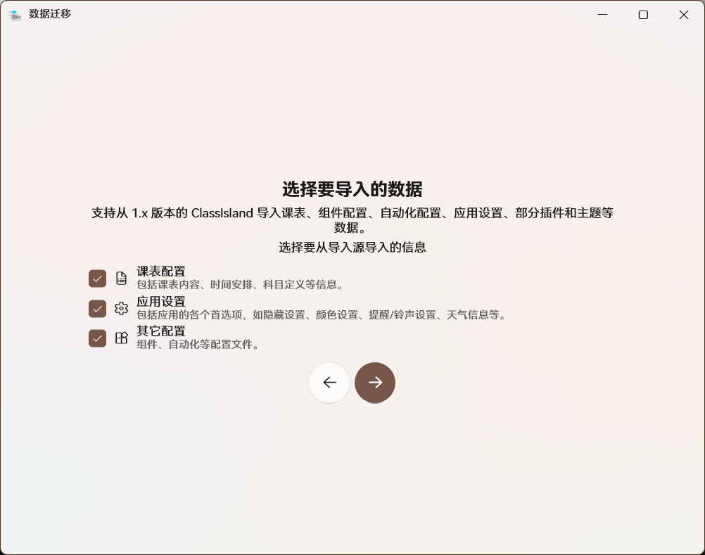
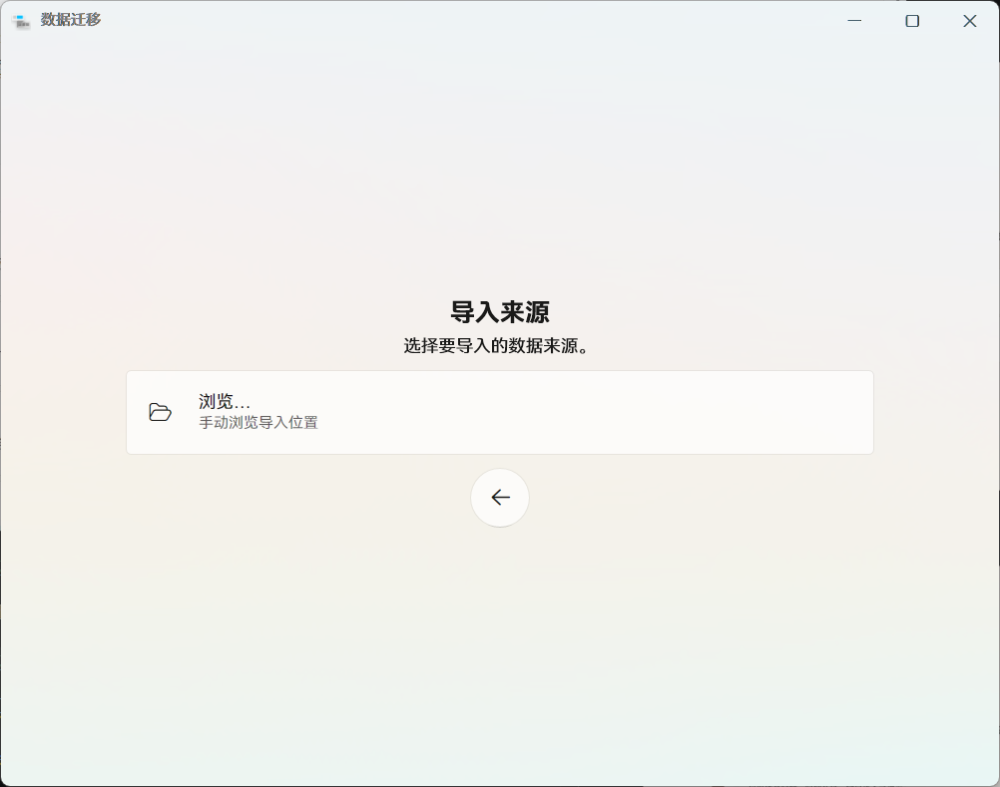
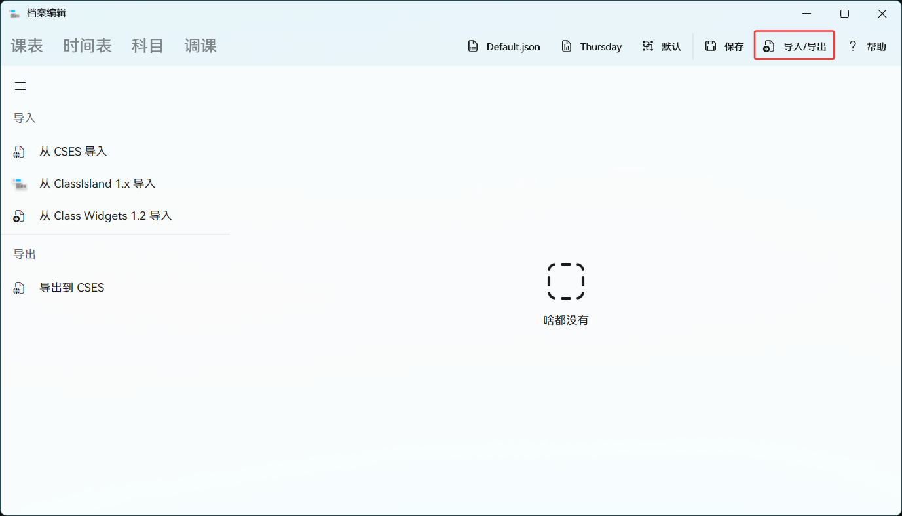
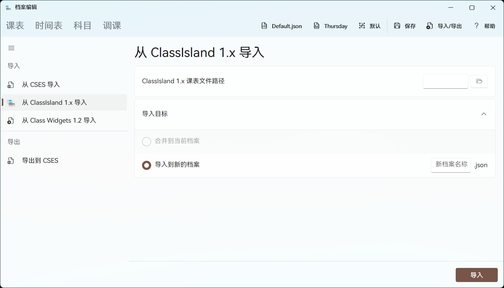
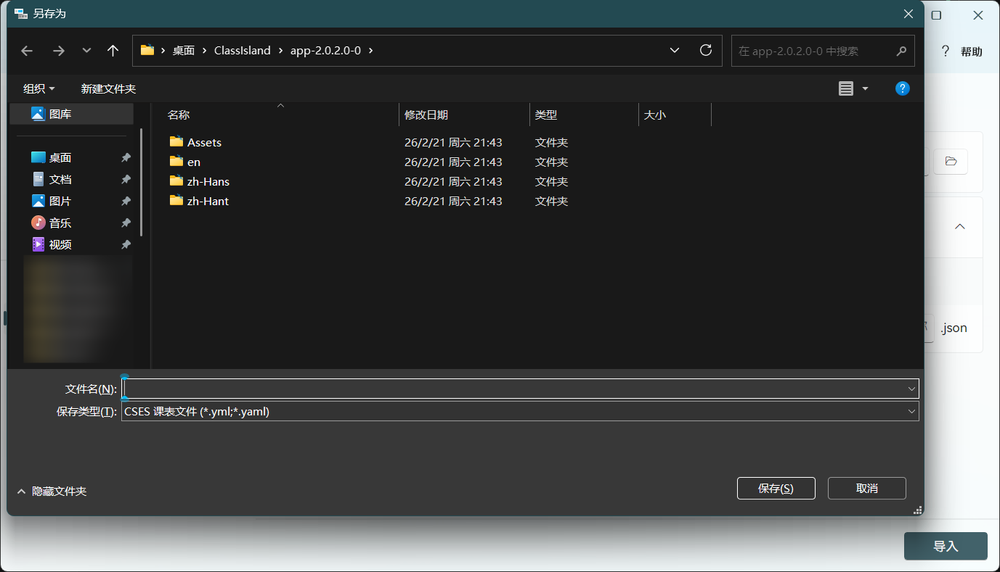

# 迁移数据

::: note 数据格式不兼容提示
已经部署在 [https://migrate.classisland.tech/](https://migrate.classisland.tech/) 上，可以直接访问使用的转换工具仅支持Classisland 1 的数据文件格式，与Classisland 2 暂不兼容。欢迎各位开发者完善此程序（使用 Vue 3 + TypeScript 开发，使用 Vite 作为构建工具。需要注意的是，本程序强制要求使用 Node 20 及 Yarn 包管理进行开发）。
:::

## 导入数据（支持CSES，Class Widget 1.2，Classisland 1.X）

### 从设置页面导入（支持Class Widget 1.2，Classisland 1.7）

在初始化设置第一页下方点击“数据迁移”选项，或在设置界面右上角三点菜单中选择“数据迁移”。

选择您**现有的**数据源类型

选择要导入的数据（全新安装一般全选即可）

按要求选择文件上传，上传完后重启Classisland即导入成功

### 从档案编辑导入（支持CSES，Class Widget 1.2，Classisland 1.X）

在档案编辑页面点击“导入/导出”按钮

选择您**现有的**数据源类型，选择数据源文件，并选择导入方式。点击导入按钮，待完成后重启。

### 从档案编辑导出（支持CSES）

在档案编辑页面点击“导入/导出”按钮后在左侧选择“导出到CSES”

选择导出路径与文件名

