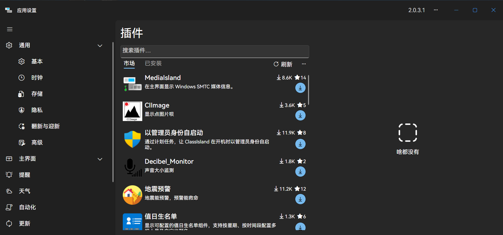
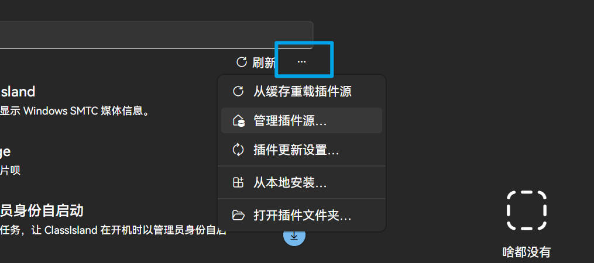
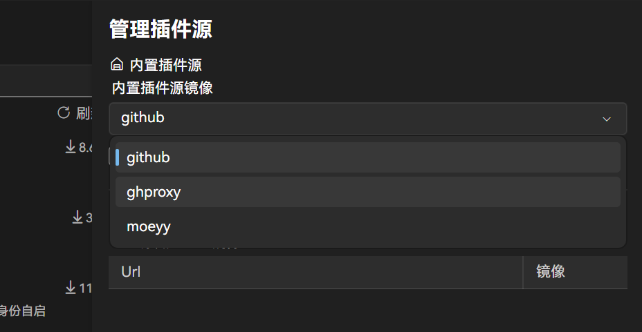
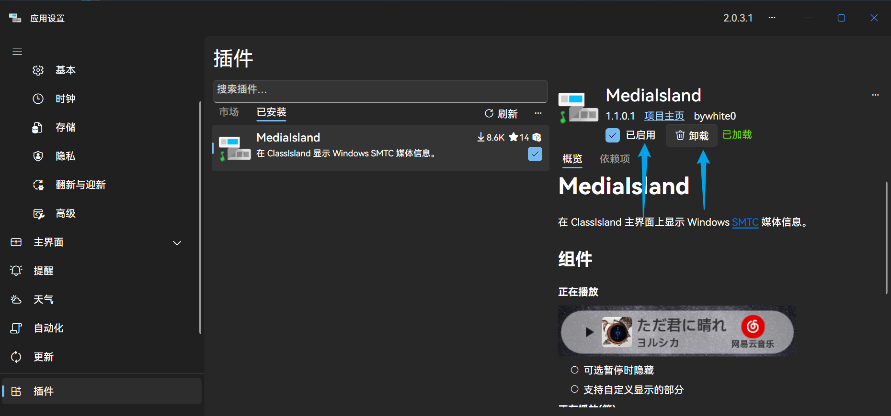

# 插件

::: info ClassIsland 欢迎您参与完善本条目☆Kira~

欢迎正在阅读这个条目的您协助编辑本条目。编辑前请阅读[条目编辑规范](../community/contributing.html)，并查找相关资料。ClassIsland 祝您在本文档度过愉快的时光。

:::

ClassIsland提供了插件功能，您可以在设置—[插件](classisland://app/settings/classisland.plugins/)的“插件市场”页面中寻找插件安装使用。

::: warning 第三方服务

插件及其提供的组件、规则集、行动等一切功能，均为第三方提供。推荐安装插件市场中的插件，请谨慎使用其他来源的插件及其安装包（压缩包）。

虽然插件市场中的插件已经进行了一轮审核，但是这依旧无法避免插件完全不存在问题。一些存在严重问题的插件可能造成程序部分或全部功能无法正常使用，甚至可能影响你的信息安全、电脑安全，请谨慎使用插件功能。

ClassIsland开发团队不对使用插件及其功能造成的问题负责。

:::

::: warning 版本差异提示

ClassIsland 1.x 和 2.x 版本使用了完全不同的框架。分别适用于这两个大版本的插件相互完全不兼容，目前插件市场采用了分类的方法，所以部分在ClassIsland 1.x 版本中可用的插件在2.x版本中可能不可用。

目前ClassIsland 2.x 还在测试开发阶段，可以使用的插件较少，请仔细阅读插件的说明文件`README.md`，以免产生严重的错误而影响应用的运行和使用。

:::

## 插件市场

插件市场中展示了由 ClassIsland 社区开发者提供的插件，您可以在其中寻找并安装插件以扩展应用的功能。

由于插件市场需要连接Github，如果由于网络问题无法连接Github或连接不稳定，您可以在更多选项-管理插件源尝试更换插件源为ghproxy或moeyy后刷新重试。

## 管理插件

您可以在设置—[插件](classisland://app/settings/classisland.plugins/)的“已安装插件”页面中管理已安装的插件。

插件存在更新时，点击更新按钮即可更新；点击插件后，如果想要禁用或卸载插件，在右侧取消勾选即可禁用插件，点击卸载按钮即可卸载插件。

::: tip
安装、更新或卸载插件后，需要重启应用以使更改生效。
:::