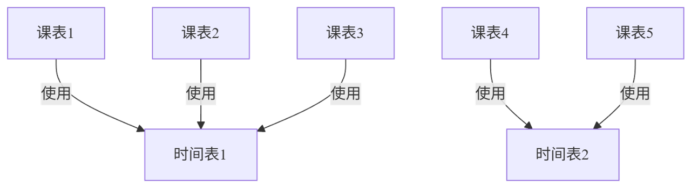
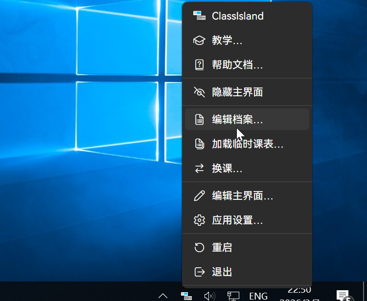
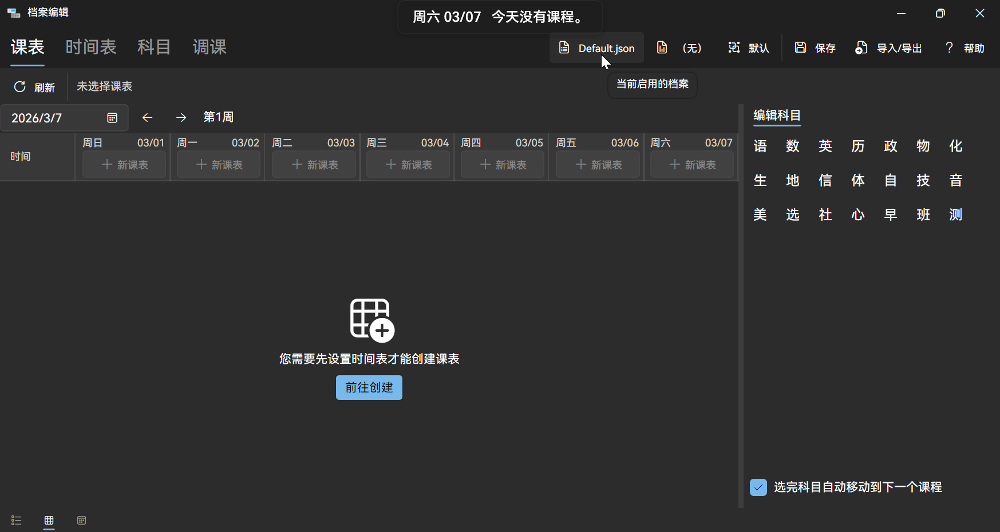
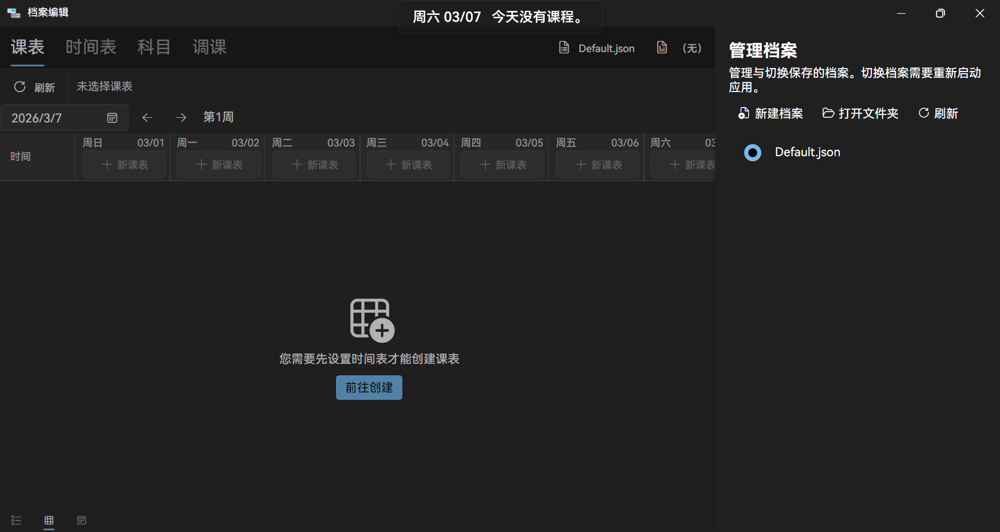
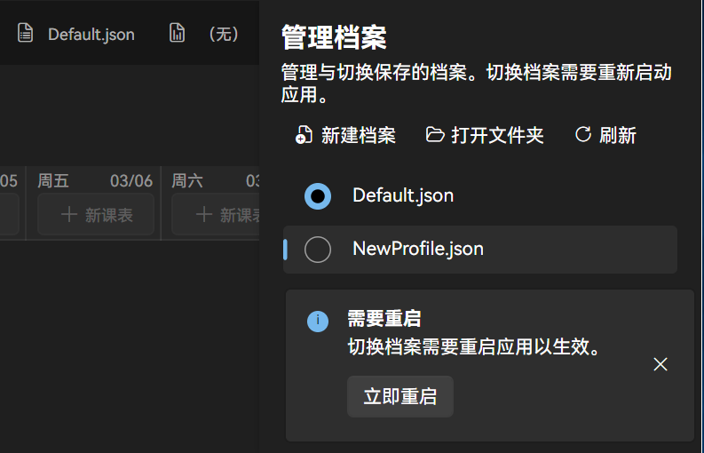
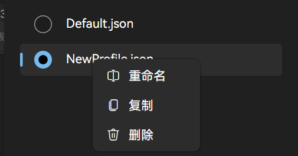

---
title: 档案编辑
description: 介绍档案管理功能。
icon: fa-solid fa-file-lines
category:
  - 使用指南
tag:
  - 档案
  - 档案编辑器
---

设置课表安排、时间表和科目的页面。

您可以手动创建课表和时间表，也可以直接将学校的课表拖入到档案编辑窗口中来导入课表。

在 ClassIsland 中，显示在主界面上的课表可以在这里编辑。这里的课表可以在满足特定条件的情况下自动启用，也可以手动启用。课表还需要定义一个时间表，来告诉软件什么时候上课、下课。时间表需按学校实际的作息安排设定，并且可以被多个课表重复使用。（如下图）

<!-- ```mermaid
graph TD 
    A["课表1"] -- > |"使用"| X["时间表1"]
    B["课表2"] -- > |"使用"| X
    C["课表3"] -- > |"使用"| X
    D["课表4"] -- > |"使用"| Y["时间表2"]
    E["课表5"] -- > |"使用"| Y
此处mermaid图为确保文档注释正确，编辑时请手动将-- >中间的空格删除。
``` -->


时间表包含了若干时间点，具有上课、课间、分割线和行动四种类型，对应学校实际作息安排的时间点，并且支持在指定时间点执行自动化操作。此外，我们还要定义各个科目，来告诉软件各科目的详细信息。定义好的科目会在编辑课表时出现在选择科目的下拉框中。

您可以阅读以下文章来详细了解档案编辑器的使用方法：

- [课表](classplan.md)
- [时间表](time-layout.md)
- [科目](subject.md)

## 打开档案编辑器

1. 打开托盘菜单，右键 ClassIsland 图标。
2. 点击【档案设置】按钮

    

## 档案管理

点击图片所示的按钮可打开档案管理界面（该按钮会显示当前启用的档案名）。



档案管理页面如图所示：



课表、时间表和科目信息都存储在一个文件中，称为 **“档案”** 。每个档案互相独立，可以随时切换，也可以很便利地转移到其它电脑上。

点击上方的【新建档案】按钮可以创建一个新的档案；如果档案列表未及时更新，您可以点击【更新】按钮来手动刷新档案列表；您也可以点击【打开文件夹】按钮来打开存储档案的文件夹，便捷地管理档案文件。

:::tip
您可以将档案文件夹中的档案文件复制到 U 盘等介质中，然后在另一台电脑上通过上述操作打开档案文件夹，再将文件复制到档案文件夹中，以实现档案文件的转移。
:::

要切换档案，请点击档案名前方的选择框。切换档案需要重新启动应用，点击弹出提示的【立即重启】按钮即可重启应用（如下图）。



要对一个档案进行操作，请在对应的档案上右键打开操作菜单，右键菜单中，您可以对档案进行重命名、复制和删除操作。



