---
icon: fa-solid fa-chart-simple
category:
  - 使用指南
tag:
  - 档案
  - 课表
  - 临时课表
  - 临时层
  - 课表群
  - 换课
---
# 课表

课表是在某一天具体的课程安排，由课程和触发规则两部分组成。课表的时间安排来源于课表对应的时间表。各个课程表设置相互独立。在开始录入课表前，您应该先录入时间表（详见文章“[时间表](time-layout.md)”）与科目（详见文章“[科目](subject.md)”）

推荐使用表格视图，它将一周内的课表集中到一处显示，使编辑课表更简易。

::: tabs

@tab 表格视图

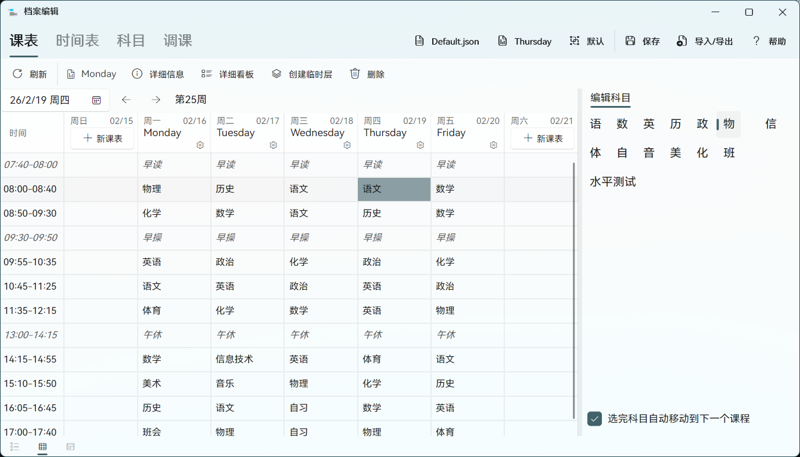

## 课程

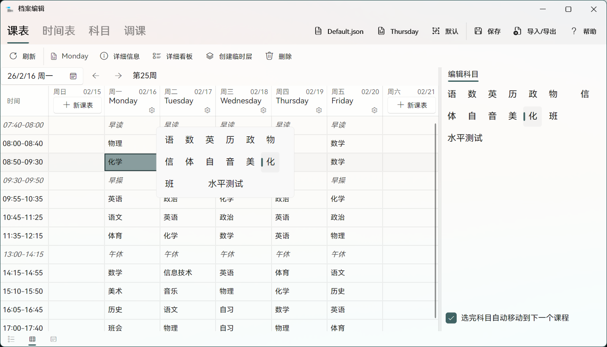

在课表中，可以给对应时间表中每个上课类型的时间点设置一个上课的科目。科目来源于【科目】选项卡定义。可以选定时间后双击或在右方科目列表中选择科目。

## 触发规则

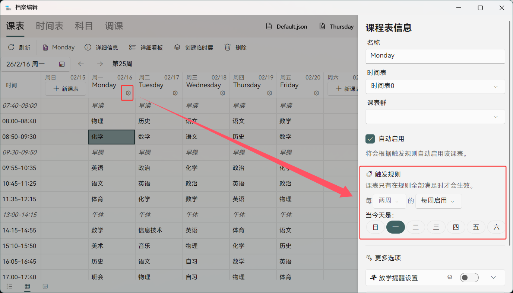

您还需要设置课表的触发规则。当触发规则全部满足时，该课表会被启用，作为当天的课表，在主界面显示（如图）。

您也可以禁用课表自动启用，这样课表不会自动加载，只能手动启用。

@tab 列表视图

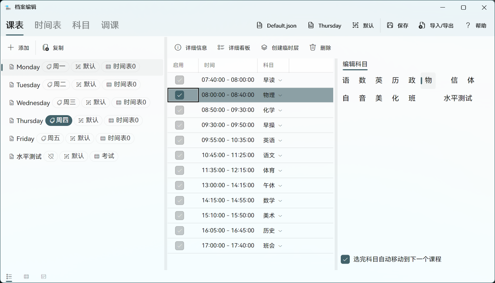

## 课程

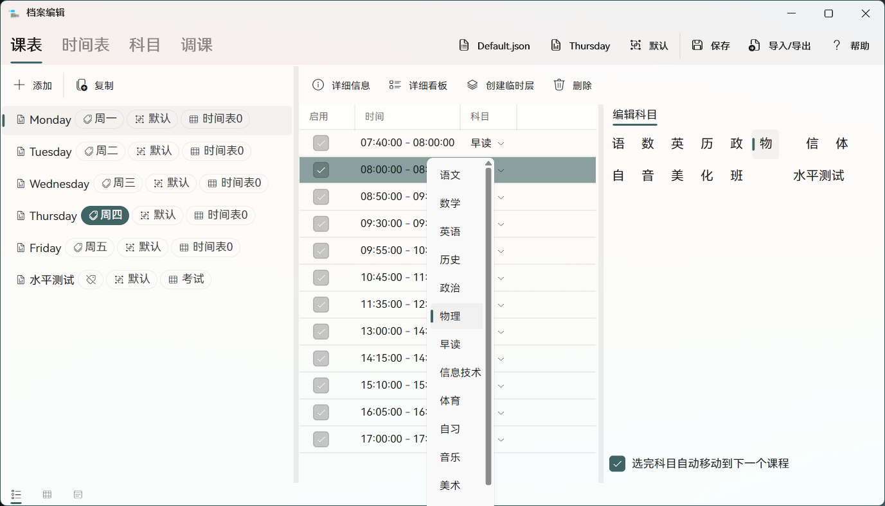

在课表中，可以给对应时间表中每个上课类型的时间点设置一个上课的科目。科目来源于【科目】选项卡定义。也可以选定时间后在右方科目列表中便捷选择。

## 触发规则

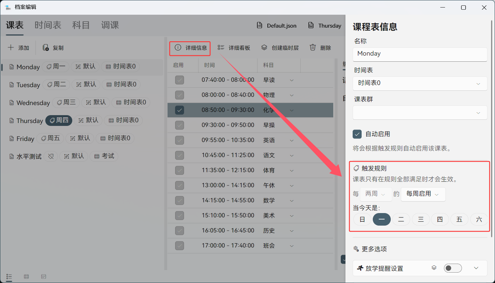

您还需要设置课表的触发规则。当触发规则全部满足时，该课表会被启用，作为当天的课表，在主界面显示（如图）。

您也可以禁用课表自动启用，这样课表不会自动加载，只能手动启用。

:::

## 临时课表与临时层

如果当天的授课计划有变，需要启用某一天的课表，可以菜单中临时启用某个课表。该课表会无视触发规则直接启用，在主界面显示。临时课表设置会在应用退出或在第二天到来时清除。您也可以通过点击【清除临时课表】按钮或直接取消勾选启用的临时课表来禁用临时课表。

要进入临时课表菜单，可以点击【课表】选项卡中工具栏上的【临时课表按钮】，也可以点击应用菜单中【加载临时课表】选项。

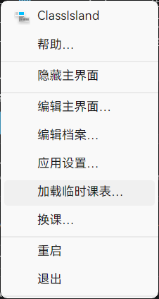

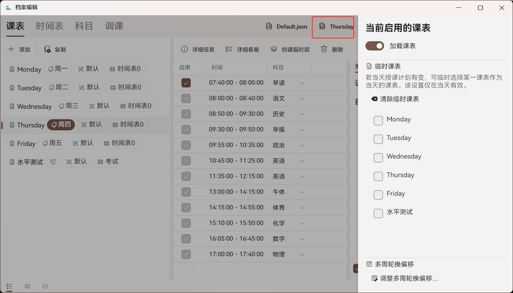

此外，您可以为一个课表创建临时层。临时层与临时课表相似，会在第二天删除。但您可以单独编辑临时层的课程安排，并不影响原课表。有临时层启用时，将自动覆盖临时课表。

## 换课

打开应用主菜单，点击【换课】按钮即可临时调换课程。以下是换课功能的使用方法。

- 打开主菜单，点击【换课】打开换课界面。

- 选择要调整的课程

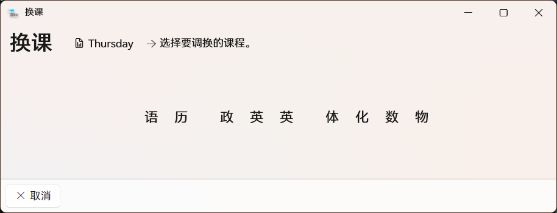

- 选择要与刚才选择的课程对调的课程，点击可以切换换课模式。点击【确认换课】以完成换课操作。

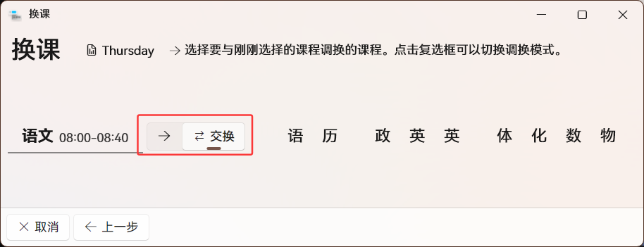

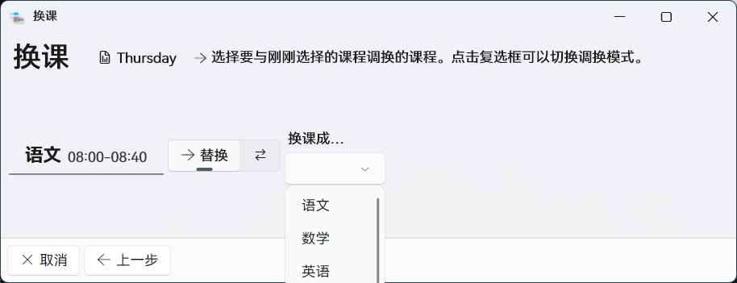

完成换课后，应用会创建一个原课表的临时层，并在临时层上调整课程安排，调整只在当日生效。您也可以勾选【永久换课】复选框，直接将换课安排写入原课表。

在新版本的档案编辑窗口中，我们引入了“换课”页面，使用表格形式，需在表格中选择课程后在工具栏选择换课类型，并按指示完成后续操作，不再赘述。

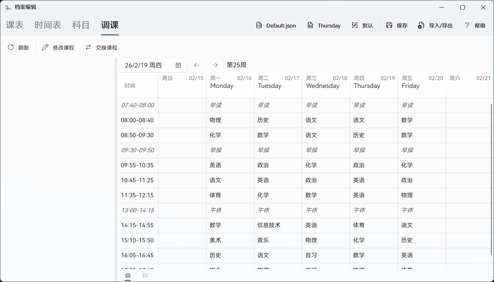

## 课表群

您可以通过课表群对课表进行分组，并灵活地启用一批课表。ClassIsland 只会加载已启用的课表群和全局课表群的课表，并且会优先加载当前启用的课表群的课表。

课表在课表编辑器中会按课表群分组显示。

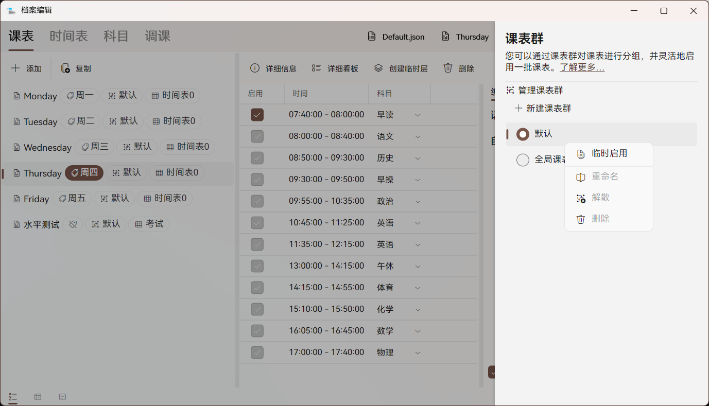

您也可以设置临时课表群，临时启用一批课表。在要临时启用的课表群上右键，然后点击【临时启用】即可临时启用课表群。临时启用的课表群的默认生效时间恰好可以轮完这个课表群中的所有课表。您可以根据需要调整失效日期。

::: note 省流

总的来说，课表按下图从左到右的优先级加载：

:::

如果选择了【继承】模式，那么加载临时课表群的课表时也会加载当前选择的课表群和全局课表群，且临时课表群中的课表会比其它课表群优先加载。如果选择了【覆盖】模式，那么只会加载临时课表群和全局课表群。
