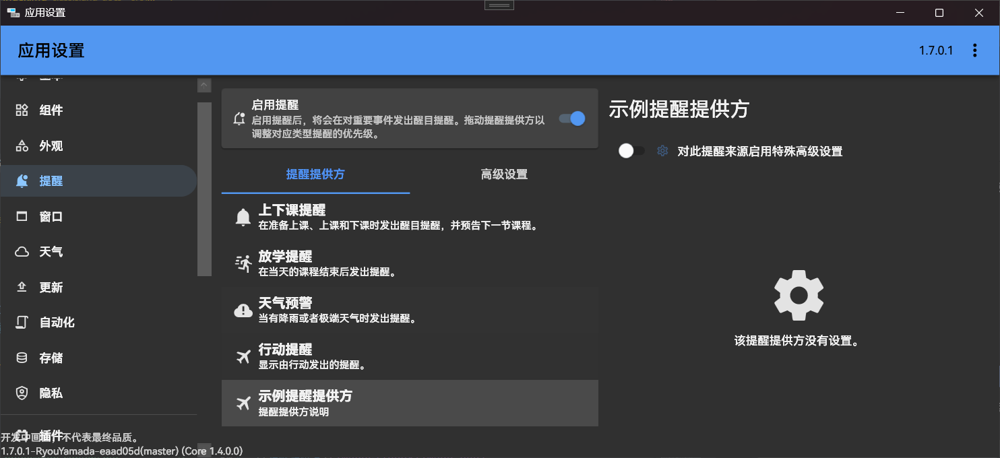
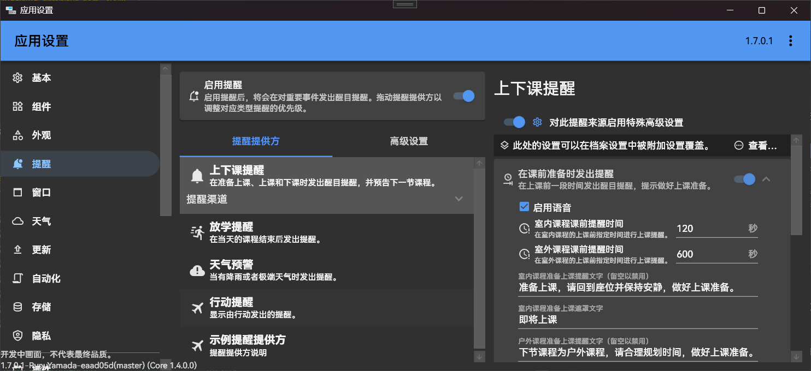
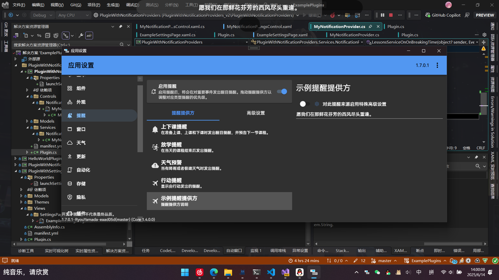

# 提醒

<UnderConstruction/>

本文主要讲述如何注册提醒提供方、添加提醒设置界面和发送提醒。

:::info
这篇文章主要讲述如何开发提醒。如果您只是要调整提醒设置的普通用户，请参考[这篇文章](../../app/notifications.md)。
:::

> [!note]
> 本文档包含的内容均基于提醒 V2 API。如果您正在开发基于提醒 V1 API（已弃用）的插件，请参阅文档[提醒（旧版）](../legacy/notifications/README.md)。

<!-- ??? note "演示视频"
    <video src="../image/index/1724501396690.mp4" muted controls loop></video> -->

提醒是 ClassIsland 中用于展示重要信息的功能，可以通过全屏特效、语音、音效等方式增强提醒效果。提醒由提醒提供方发出，由提醒主机管理提醒和提醒提供方，最终由主界面展示。

::: info 示例
注册提醒提供方的完整示例代码可以在[示例插件仓库](https://github.com/ClassIsland/ExamplePlugins/tree/master/PluginWithNotificationProviders)上查看。
:::

## 注册提醒提供方

提醒提供方是一个继承[`NotificationProviderBase`](https://api.docs.classisland.tech/api/ClassIsland.Core.Abstractions.Services.NotificationProviders.NotificationProviderBase.html)基类的托管服务（[`IHostService`](https://learn.microsoft.com/zh-cn/dotnet/api/microsoft.extensions.hosting.ihostedservice)），会在应用主机启动后自动启动。

要注册提醒提供方，我们首先需要创建一个继承[`NotificationProviderBase`](https://api.docs.classisland.tech/api/ClassIsland.Core.Abstractions.Services.NotificationProviders.NotificationProviderBase.html)的提醒提供方类，并为这个类添加[`NotificationProviderInfo`](https://api.docs.classisland.tech/api/ClassIsland.Core.Attributes.NotificationProviderInfo.html)属性，如下方代码所示，

``` csharp title="Services/NotificationProviders/MyNotificationProvider.cs"
using ClassIsland.Core.Abstractions.Services;
using ClassIsland.Shared.Interfaces;
using Microsoft.Extensions.Hosting;

namespace PluginWithNotificationProviders.Services.NotificationProviders;

[NotificationProviderInfo("DD3BC389-BEA9-40B7-912B-C7C37390A101", "示例提醒提供方", PackIconKind.Airplane, "提醒提供方说明")]
public class ActionNotificationProvider : NotificationProviderBase {
    
}
```

上面的代码内容可能有点多，不用害怕，我们一点一点来看。

提醒提供方类中的[`NotificationProviderInfo`](https://api.docs.classisland.tech/api/ClassIsland.Core.Attributes.NotificationProviderInfo.html)属性声明了这个提醒提供方的基本信息。您可以通过修改里面的属性为提醒提供方指定名称、描述、图标等信息

``` csharp
[NotificationProviderInfo(
    "DD3BC389-BEA9-40B7-912B-C7C37390A101",  // 提醒提供方 GUID
    "示例提醒提供方",  // 提醒提供方名称 
    PackIconKind.Airplane,  // 提醒提供方图标
    "提醒提供方说明"  // 提醒提供方说明
)]
```

关于[`NotificationProviderInfo`](https://api.docs.classisland.tech/api/ClassIsland.Core.Attributes.NotificationProviderInfo.html)属性的更多信息可以查看文档[NotificationProviderInfo 类](https://api.docs.classisland.tech/api/ClassIsland.Core.Attributes.NotificationProviderInfo.html)。

接着我们还需要在[插件初始化方法](../plugins/plugin-base.md#初始化方法)，或应用主机配置方法中添加以下代码，将这个提醒提供方注册到应用主机上。

```csharp
services.AddNotificationProvider<MyNotificationProvider>();
```

上面的代码将这个提醒提供方注册到了服务主机上，这样这个提醒提供方就会在应用启动时启动，并显示在【提醒】设置页面中。



## 显示提醒

注册好提醒主机后，我们的提醒主机就可以发送提醒了。您可以通过订阅您感兴趣的事件（如[上课事件](../events.md#上课事件)、[下课事件](../events.md#下课事件)等），在合适的时机显示提醒。

### 组成

一个提醒由以下部分组成：

- **遮罩（Mask）**：提醒进入时显示的内容，使用主题色作为背景，一般用于吸引注意力和总结提醒内容。
    
- **正文（Overlay）_（可选）_**：遮罩显示结束后，显示的提醒正文。如果没有正文内容则不会显示。


### 订阅事件

我们以在下课时显示提醒为例，添加以下代码获取课程服务，并订阅[下课事件](../events.md#下课事件)：

``` csharp title="Services/NotificationProviders/MyNotificationProvider.cs" hl_lines="7-18"
// ...

namespace PluginWithNotificationProviders.Services.NotificationProviders;

[NotificationProviderInfo("DD3BC389-BEA9-40B7-912B-C7C37390A101", "示例提醒提供方", PackIconKind.Airplane, "提醒提供方说明")]
public class ActionNotificationProvider : NotificationProviderBase {
    public ILessonsService LessonsService { get; }

    public MyNotificationProvider(ILessonsService lessonsService)
    {
        LessonsService = lessonsService;  // 将课程服务实例保存到属性中备用
        LessonsService.OnBreakingTime += LessonsServiceOnOnBreakingTime;  // 注册下课事件
    }

    private void LessonsServiceOnOnBreakingTime(object? sender, EventArgs e)
    {
    
    }

    // ...
}
```

上面高亮的代码通过在构造函数中添加课程服务参数，获取了课程服务实例，并保存到`LessonsService`属性中备用。接着订阅了[下课事件](../events.md#下课事件)`OnBreakingTime`的事件处理程序`LessonsServiceOnOnBreakingTime`。当下课时，事件处理程序`LessonsServiceOnOnBreakingTime`中的代码就会被调用。

### 提醒请求

提醒请求[`NotificationRequest`](https://api.docs.classisland.tech/api/ClassIsland.Core.Models.Notification.NotificationRequest.html)包含了提醒的一些关键信息，比如提醒遮罩和正文内容等。下面是提醒请求的一些常用属性：

| 属性名 | 类型 | 必填？ | 说明 |
| -- | -- | -- | -- |
| MaskContent | `NotificationContent` | **是** | 提醒遮罩内容，在提醒进入时显示。 |
| OverlayContent | `NotificationContent?` | 否 | 提醒正文内容。 |

其中 `MaskContent` 和 `OverlayContent` 属性类型是提醒内容[`NotificationContent`](https://api.docs.classisland.tech/api/ClassIsland.Core.Models.Notification.NotificationContent.html)，指定了提醒对应部分的内容信息，比如显示内容、显示时长和朗读内容等。您可以自定义其中的内容，也可以直接使用应用提供的[提醒内容模板](./notification-content.md#提醒内容模板)。

我们可以通过提醒提供方基类提供的方法[ShowNotification](https://api.docs.classisland.tech/api/ClassIsland.Core.Abstractions.Services.NotificationProviders.NotificationProviderBase.html#ClassIsland_Core_Abstractions_Services_NotificationProviders_NotificationProviderBase_ShowNotification_ClassIsland_Core_Models_Notification_NotificationRequest_)直接发送一个提醒。在 LessonsServiceOnOnBreakingTime 方法中添加如下代码：

``` csharp title="Services/NotificationProviders/MyNotificationProvider.cs" 
// ...
public class ActionNotificationProvider : NotificationProviderBase {
    // ...

    private void LessonsServiceOnOnBreakingTime(object? sender, EventArgs e)
    {
        ShowNotification(new NotificationRequest()
        {
            MaskContent = NotificationContent.CreateTwoIconsMask("Hello world!"),
            OverlayContent = NotificationContent.CreateSimpleTextContent("测试提醒")
        });
    }

    // ...
}
```

上面的代码会在收到下课提醒事件时发出一个提醒，其中提醒遮罩使用了 _双图标提醒遮罩模板_，文本内容为“Hello world!”；提醒正文使用了 _文本提醒正文模板_，文本内容为“测试提醒”。[`NotificationContent` 类](https://api.docs.classisland.tech/api/ClassIsland.Core.Models.Notification.NotificationContent.html)中还包含了其它的提醒内容模板，您可以阅读文档[提醒内容模板](./notification-content.md#提醒内容模板)了解更多。

在下课时或在调试页面手动触发下课事件时，可以看到我们刚刚定义的提醒显示了：


如果您想要更深入地自定义提醒各个部分显示的内容，可以阅读文档[提醒内容](./notification-content.md)。

🎉恭喜！您成功从代码显示一条提醒！

## 提醒设置

一般情况下，提醒提供方会提供一些可以调节的设置选项，如下图：



接下来我们会给我们的提醒提供方添加一个设置界面，并允许用户自定义提醒显示的内容。

新建提醒设置类`MyNotificationSettings`，用于存储我们的设置：

``` csharp title="Models/MyNotificationSettings.cs"
using CommunityToolkit.Mvvm.ComponentModel;

namespace PluginWithNotificationProviders.Models;

public class MyNotificationSettings : ObservableRecipient
{
    private string _message = "";

    /// <summary>
    /// 要显示的文本
    /// </summary>
    public string Message
    {
        get => _message;
        set
        {
            if (value == _message) return;
            _message = value;
            OnPropertyChanged();
        }
    }
}
```

上面的代码定义了一个名为`MyNotificationSettings`的属性，包含了`Message`属性，用来存储自定义的消息内容。

此外，我们还需要修改我们的提醒提供方定义，在基类[`NotificationProviderBase`](https://api.docs.classisland.tech/api/ClassIsland.Core.Abstractions.Services.NotificationProviders.NotificationProviderBase.html?q=notificationproviderbase)中添加类型参数，内容是我们刚刚定义的设置类 `MyNotificationSettings`，以告诉应用存储这个提醒提供方的设置对象类型是 `MyNotificationSettings`。

``` csharp title="Services/NotificationProviders/MyNotificationProvider.cs" hl_lines="8"
// ...

namespace PluginWithNotificationProviders.Services.NotificationProviders;

[NotificationProviderInfo(
    "DD3BC389-BEA9-40B7-912B-C7C37390A101", "示例提醒提供方", PackIconKind.Airplane, "提醒提供方说明"
)]
public class MyNotificationProvider : NotificationProviderBase<MyNotificationSettings>
{
    // ...
}
```

这样应用会自动处理设置对象的存储，并在加载提醒提供方的时候自动将设置对象注入到[Settings 属性](https://api.docs.classisland.tech/api/ClassIsland.Core.Abstractions.Services.NotificationProviders.NotificationProviderBase-1.html#ClassIsland_Core_Abstractions_Services_NotificationProviders_NotificationProviderBase_1_Settings)上。

接着修改下课的事件处理程序发送的提醒请求的正文部分，将文本修改为在设置中指定的消息。

``` csharp title="Services/NotificationProviders/MyNotificationProvider.cs" hl_lines="11"
namespace PluginWithNotificationProviders.Services.NotificationProviders;

public class MyNotificationProvider : NotificationProviderBase<MyNotificationSettings>
{
    // ...
    private void LessonsServiceOnOnBreakingTime(object? sender, EventArgs e)
    {
        ShowNotification(new NotificationRequest()
        {
            MaskContent = NotificationContent.CreateTwoIconsMask("Hello world!"),
            OverlayContent = NotificationContent.CreateSimpleTextContent(Settings.Message)
        });
    }
    // ...
}
```

上面的代码将提醒提供方设置中的`Message`属性作为显示内容。这样显示提醒时，就可以显示我们自定义的文本。

接着我们需要创建提醒设置界面，以调整要自定义显示的文本。添加以下代码：

:::tabs
@tab <HopeIcon icon="code"/> `Controls/NotificationProviders/MyNotificationProviderSettingsControl.xaml`

``` xml
<ci:NotificationProviderControlBase
    x:Class="PluginWithNotificationProviders.Controls.NotificationProviders.MyNotificationProviderSettingsControl"
    x:TypeArguments="models:MyNotificationSettings"
    xmlns="http://schemas.microsoft.com/winfx/2006/xaml/presentation"
    xmlns:x="http://schemas.microsoft.com/winfx/2006/xaml"
    xmlns:mc="http://schemas.openxmlformats.org/markup-compatibility/2006"
    xmlns:d="http://schemas.microsoft.com/expression/blend/2008"
    xmlns:ci="http://classisland.tech/schemas/xaml/core"
    xmlns:local="clr-namespace:PluginWithNotificationProviders.Controls.NotificationProviders"
    mc:Ignorable="d"
    d:DesignHeight="300" d:DesignWidth="300">
    <StackPanel DataContext="{Binding RelativeSource={RelativeSource FindAncestor, AncestorType=local:MyNotificationProviderSettingsControl}}">
        <TextBox Text="{Binding Settings.Message}"/>
    </StackPanel>
</ci:NotificationProviderControlBase>

```

@tab <HopeIcon icon="code"/> `Controls/NotificationProviders/MyNotificationProviderSettingsControl.xaml.cs`

``` csharp
namespace PluginWithNotificationProviders.Controls.NotificationProviders;

public partial class MyNotificationProviderSettingsControl
{
    public MyNotificationProviderSettingsControl()
    {
        InitializeComponent();
    }
}
```

:::

然后我们需要在[插件初始化方法](../plugins/plugin-base.md#初始化方法)中注册提醒提供方的调用中，指定第二个类型参数[`TNotificationProviderSettingsControl`](https://api.docs.classisland.tech/api/ClassIsland.Core.Extensions.Registry.NotificationProviderRegistryExtensions.html#%E7%B1%BB%E5%9E%8B%E5%8F%82%E6%95%B0-1)为我们刚刚创建的设置界面控件类型`MyNotificationProviderSettingsControl`。

```csharp hl_lines="1"
services.AddNotificationProvider<MyNotificationProvider, MyNotificationProviderSettingsControl>();
```

完成上面步骤之后，打开提醒设置，可以看到提醒设置部分出现了我们在提醒设置控件中定义的文本框，同时在下课时也会在提醒正文中显示文本框中的内容。



## 进阶

以上就是提醒提供方 API 的基本用法。您可以继续阅读文章[提醒内容](./notification-content.md)来了解如何进一步自定义提醒显示的内容，也可以阅读文章[提醒进阶](./advanced.md)来了解更深层次的提醒 API 用法。
