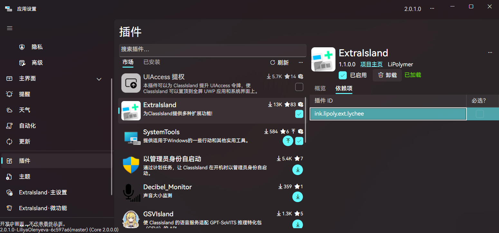
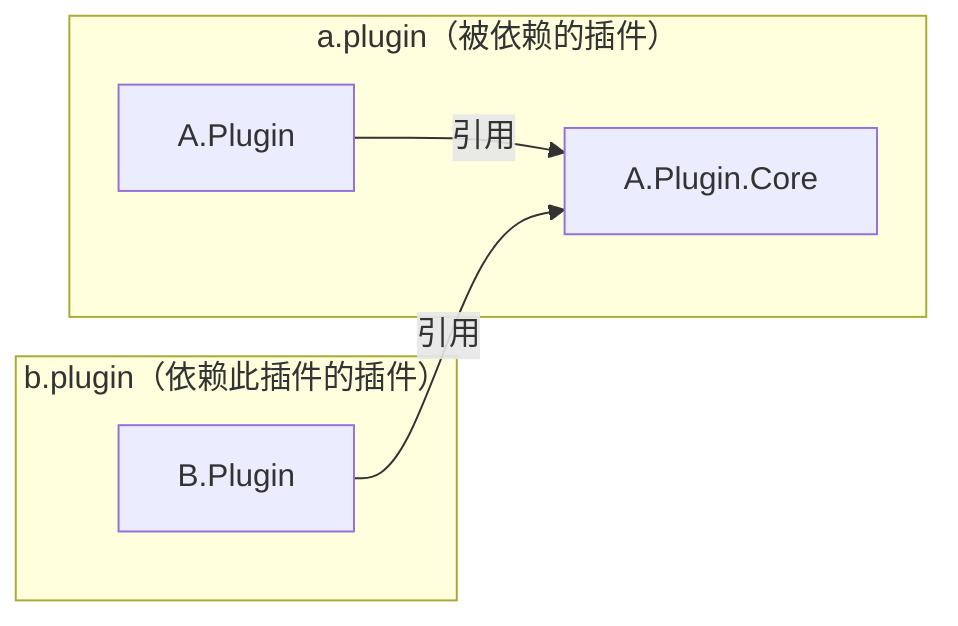
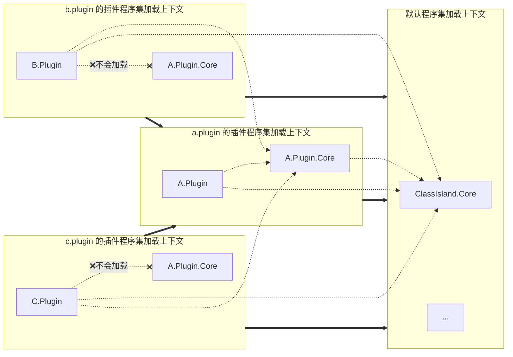
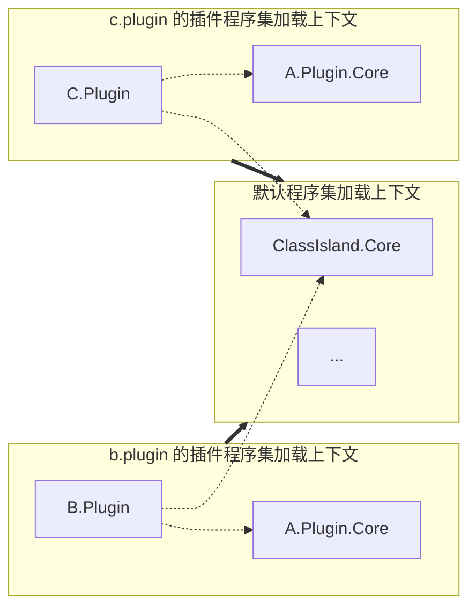

# 插件依赖

> [!note]
> 在阅读本文前，建议先了解[插件的程序集加载上下文隔离机制](./basics.md#程序集隔离)。



在开发 ClassIsland 插件时，有时我们想要调用其它插件里的功能，或者与其它插件联动。这时我们可以通过在插件清单声明插件依赖，允许插件加载指定插件程序集上下文里的类型，实现调用其它插件的功能和插件间联动。被依赖的插件会先于依赖它的插件加载，以确保被依赖的插件已经初始化完成。

## 添加插件依赖

添加插件依赖需要在清单文件的 `dependencies` 列表中添加依赖的插件信息，例如：

``` yaml title="manifest.yml"
#...
dependencies:
  - id: a.plugin
```

默认情况下，添加的依赖项是必须的。如果您希望依赖项可选，可在对应的插件信息中设置 `isRequired` 为 `false`：

``` yaml title="manifest.yml"
#...
dependencies:
  - id: a.plugin
    isRequired: false
```

ClassIsland 将在插件加载时验证依赖关系。如果某个插件依赖关系不满足，那么这个插件将不会被加载。

## 共享插件接口

此时我们已经成功声明了插件的依赖，并且也可以访问被依赖的插件的类型了。但被依赖的插件还没有共享任何接口，我们需要先在被依赖的插件定义并共享相应的接口给其它插件，这样其它插件才能顺利访问并调用相应的接口。

一般情况下，我们可以采取如下图所示的，将被依赖的插件中的服务和共享接口拆分到一个单独的项目中，然后再在被依赖的插件和依赖此插件的插件中引用此项目的方式来共享接口：



其中 `A.Plugin.Core` 项目包含了被依赖的插件 `A.Plugin` 中服务的抽象接口。`B.Plugin` 项目引用了 `A.Plugin.Core` 项目，从而可以访问并调用 `A.Plugin` 中实现的服务。关于如何暴露服务的详细内容，请见[依赖注入中的暴露服务章节](../basics/dependency-injection.md#暴露服务)。

为了能让其它插件调用 `A.Plugin.Core` 中定义的服务和接口，我们可以将这个项目打包并发布到 [nuget.org](https://www.nuget.org/) 上，让其它插件引用并使用。

## 调用依赖插件

在[声明插件依赖](#添加插件依赖)并引用了这个插件提供的共享库后，我们就可以在依赖此插件的插件中引用并调用 `A.Plugin.Core` 中定义的服务和各种接口了。

如果插件依赖是可选的，那么依赖的插件所提供的服务可能存在不存在的情况，这时我们需要考虑妥善处理这种情况。如果您通过[依赖注入](../basics/dependency-injection.md)调用了依赖插件的服务或功能，可能需要考虑将这个服务声明为可选的，或者通过 `IAppHost.TryGetService<T>()` 方法来获取服务，避免在服务不存在时抛出异常。

## 插件依赖是如何工作的

在声明插件依赖后，查找程序集时会优先从依赖的插件的插件程序集加载上下文中查找，以保证插件和被依赖的插件所调用的类型是一致的，如图所示：



如果插件依赖是必选的，那么 ClassIsland 会保证依赖插件的程序集一定存在，此时各个依赖了此插件的插件加载的共享库的程序集也一定是相同的。然而如果插件依赖是可选的，那么就可能会出现依赖的插件不存在的情况。此时依赖此插件的插件就会加载自身携带的共享库程序集，而不是依赖插件的共享库程序集，且共享库中类型的状态就不是跨插件共享的。如图：


