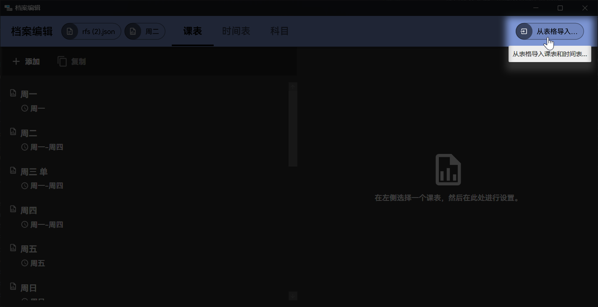
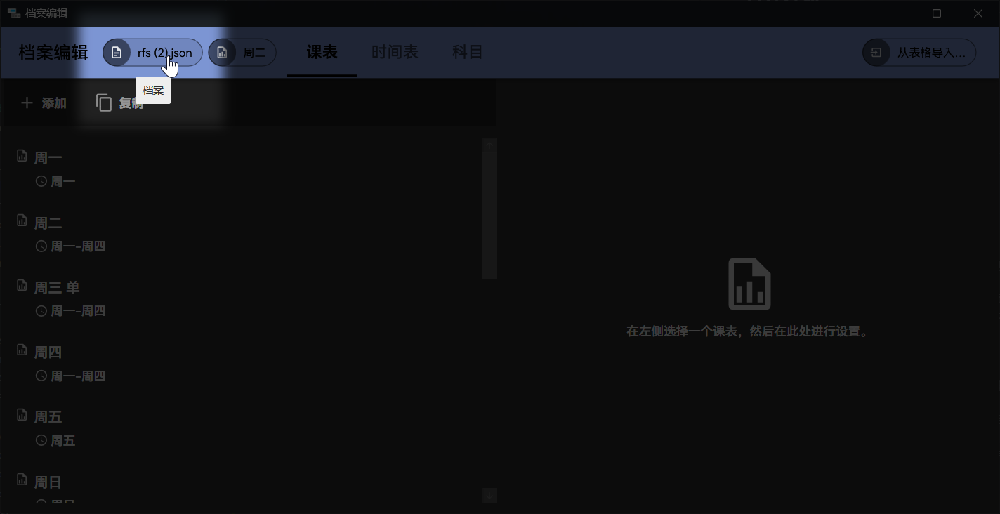
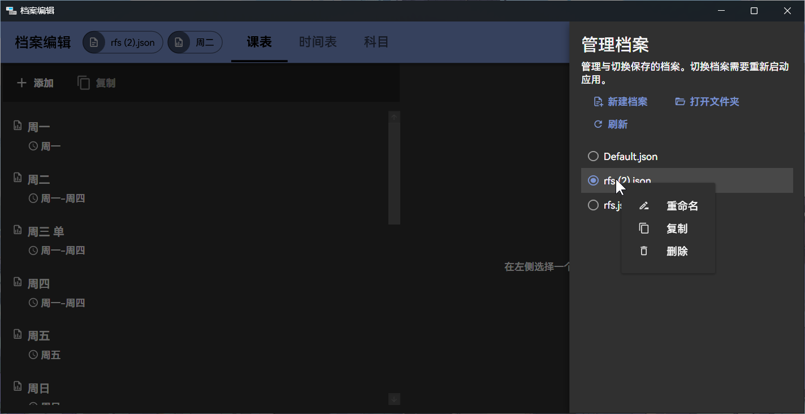

---
title: Profile Settings
---

The page for setting up class schedules, timetables, and subjects.

You can manually create class schedules and timetables, or directly drag your school's schedule into the profile editing window to import it.

In ClassIsland, the class schedule displayed on the main interface can be edited here. These schedules can be automatically activated under certain conditions or manually activated. The schedule also requires a timetable to inform the software when classes start and end. The timetable should be set according to the actual schedule of the school and can be reused by multiple schedules (as shown in the figure below).

```mermaid
graph TD 
    A["Schedule 1"] --> |"uses"| X["Timetable 1"]
    B["Schedule 2"] --> |"uses"| X
    C["Schedule 3"] --> |"uses"| X
    D["Schedule 4"] --> |"uses"| Y["Timetable 2"]
    E["Schedule 5"] --> |"uses"| Y
```
The timetable contains several time points, with three types: class start, class end, and divider, corresponding to the actual schedule of the school. Additionally, we need to define each subject to provide detailed information about each subject to the software. The defined subjects will appear in the subject selection dropdown when editing the timetable.

You can read the following articles to learn more about how to use the profile editor in detail:

- [Timetable](classplan.md)
- [Time Layout](time-layout.md)
- [Subject](subject.md)

## Open the Profile Editor

1. Open the tray menu
2. Click the [Profile Settings] button

    

## Import from Spreadsheet

You can import timetables and time layouts from a spreadsheet. Click the [Import from Spreadsheet...] button at the top right to open the import wizard, or you can directly drag the spreadsheet file into the profile editing window to start the wizard.

## Profile Management

Click the [Profile] button to open the profile management interface.

Timetable, time layout, and subject information are all stored in a single file called a **"profile"**. Each profile is independent and can be switched at any time, and can be easily transferred to another computer.

To switch profiles, click the checkbox in front of the profile name. Switching profiles requires restarting the application. Click the [Restart] button in the pop-up prompt to restart the application (as shown below).

To operate on a profile, right-click on the corresponding profile to open the operation menu.

Use the [Open Folder] button to browse the folder where the profiles are stored, allowing you to manually manage the application profiles.

:::tip
You can copy the profile files from the profile folder to a USB drive or other media, and then on another computer, open the profile folder through the above operation and copy the files into the profile folder to transfer the profile files.
:::