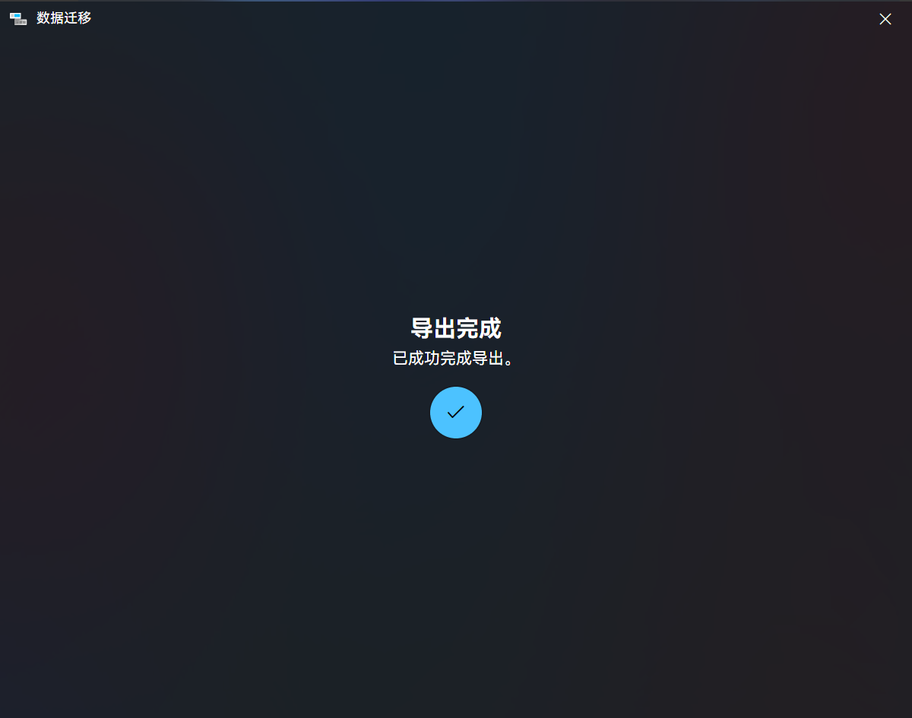
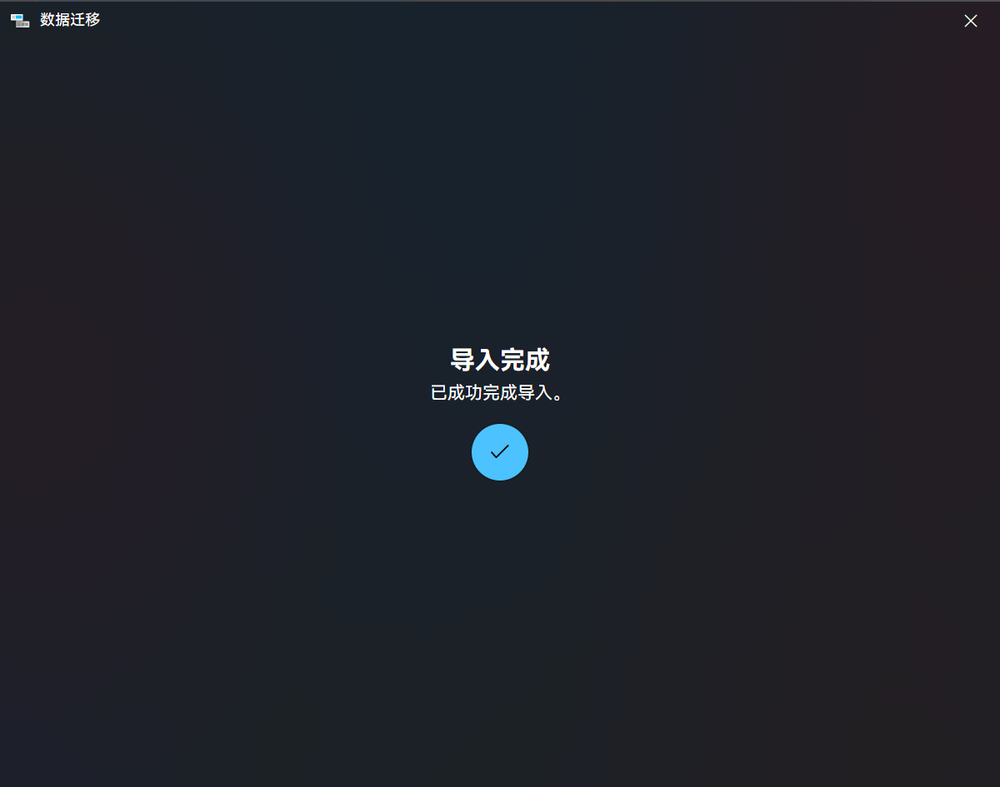

# 部署到班级大屏

在自己的设备上配置好应用后，我们便可以将这些配置转移到大屏上，在大屏上部署应用了。

::: caution 不要使用网盘同步应用数据
将 ClassIsland 安装到网盘同步目录中，或者是将应用数据文件夹纳入网盘同步范围，都很可能会与 ClassIsland 产生冲突，甚至会永久损坏您的配置。**不要将 ClassIsland 安装在网盘目录或使用网盘同步应用数据。**
:::

总地来说，分为以下几步：

1. 导出应用数据
2. 提前准备好适用于大屏环境的 ClassIsland 软件本体
3. 在大屏上安装 ClassIsland
4. 导入应用数据

**👉 在开始之前，做好以下准备：**

- 按照[检查系统配置](setup.md#检查系统配置)章节的指引，获取班级大屏的系统信息
- 在您的设备上配置好的 ClassIsland 实例
- 一个存储空间至少 4GB 的合格正牌 U 盘，以便传输应用数据
    您也可以通过其它介质（如网盘）来传输应用数据文件

下面我们来详细介绍。

## 导出应用数据

要导出应用配置，我们需要使用应用的【数据迁移】功能。

**👉 打开主菜单，点击【应用设置…】打开应用设置窗口。**

**👉 点击【更多选项…（右上角三个点）】按钮，然后点击弹出的菜单中的【数据迁移…】选项。**

这样，我们就打开了数据迁移窗口。接下来我们要在【导出】选项中将应用的所有数据导出为可以在其它 ClassIsland 实例导入的数据格式。

**👉 点击【导出】页签，然后点击【ClassIsland 2.x】选项。**

接下来我们进入了导出内容选择。**一般情况下，保持这些选项默认就可以了。** 您也可以按需求调整要导出的内容。

**👉 点击【→】按钮继续。**

**👉 点击【浏览…】选项，保存导出的数据到您用于转移数据的 U 盘或其它介质。**

当出现这个页面时，就说明导出已顺利完成。这样我们就获得了 ClassIsland 数据文件（.cidata）。我们接下来可以在其它 ClassIsland 实例中导入此文件。

## 下载与安装 ClassIsland 本体

我们接下来还需要准备安装到大屏的 ClassIsland 本体。您可以在家中将应用本体下载好，然后再拷贝到大屏上；您也可以在大屏上现场下载应用。

**👉 按照[下载与安装](./setup.md)的步骤下载 ClassIsland 本体。**

如果您在您的电脑上下载好了本体，**👉 将下载好的文件拷贝到您用于转移数据的 U 盘或其它介质。**

> [!warning]
> 别忘了把 U 盘带去学校。

将您用于转移数据的 U 盘或其它介质带到学校后，或者是在学校电脑上下载好应用本体后，**👉 按照[下载与安装](./setup.md)的步骤安装 ClassIsland 本体。**

至此，我们就已经成功地将 ClassIsland 部署到大屏电脑上了，接下来我们需要将数据导入到应用中。

## 导入应用数据

我们之前已经在应用里导出了可以在其它 ClassIsland 实例导入的 ClassIsland 数据文件（.cidata），接下来我们使用【数据迁移】功能把这个文件中的数据导入到大屏的实例中。

**👉 在欢迎界面中，点击【数据迁移按钮】。**

如果您已完成初始设置，**👉 打开主菜单，点击【应用设置…】打开应用设置窗口。**

**👉 点击【更多选项…（右上角三个点）】按钮，然后点击弹出的菜单中的【数据迁移…】选项。**

这样我们就打开了数据迁移界面。接下来的导入操作和之前的导出操作类似，我们需要选择【ClassIsland 2.x】导入，然后导入之前导出的 ClassIsland 数据文件。

**👉 点击【ClassIsland 2.x】选项。**

接下来我们进入了导入内容选择。**一般情况下，保持这些选项默认就可以了。** 您也可以按需求调整要导入的内容。

**👉 点击【→】按钮继续。**

**👉 点击【浏览…】选项，选择存储在您用于转移数据的 U 盘或其它介质中的 ClassIsland 数据文件**

稍等片刻，当应用出现这个页面时，就说明我们已经成功将在您个人设备上配置好的应用数据转移到了大屏上。

**🎉恭喜！您已成功将 ClassIsland 部署到班级大屏上！**

## 便携版迁移

由于便携版 ClassIsland 中所有数据都存储在安装目录下，如果您使用的是**便携版**的 ClassIsland，且大屏的应用平台与您个人设备上所安装的平台匹配，您还可以直接将**整个**应用安装目录通过 U 盘等介质拷贝到大屏上，以实现快速部署。具体方法在此不做详细介绍。
